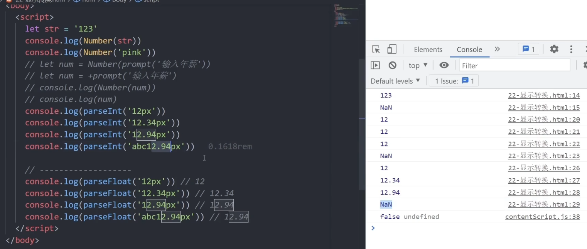
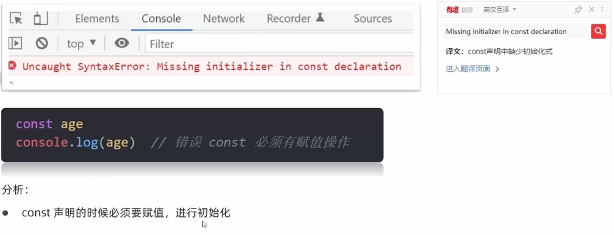
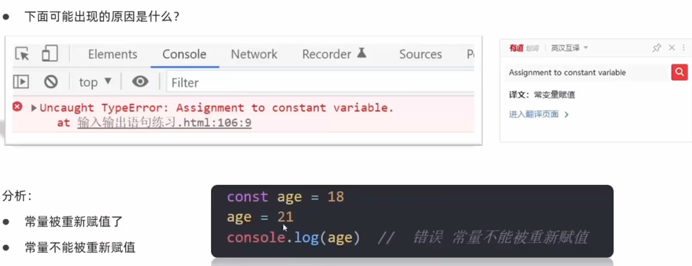
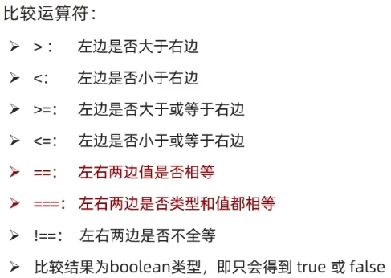
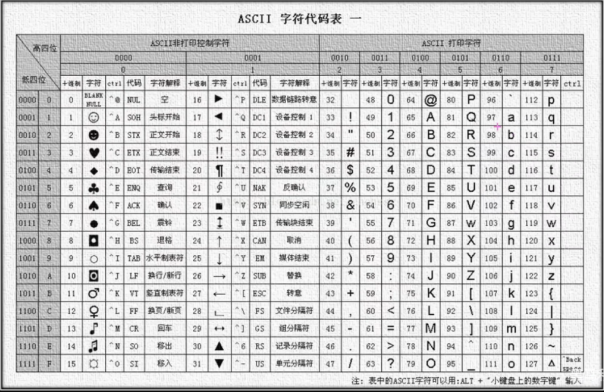
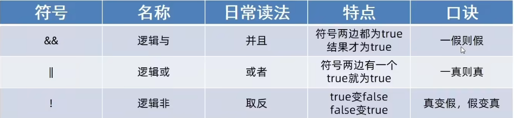
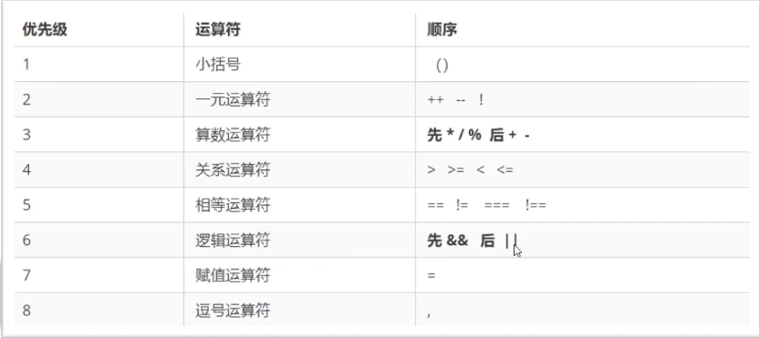
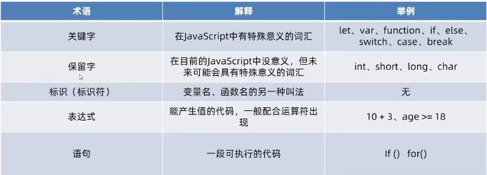
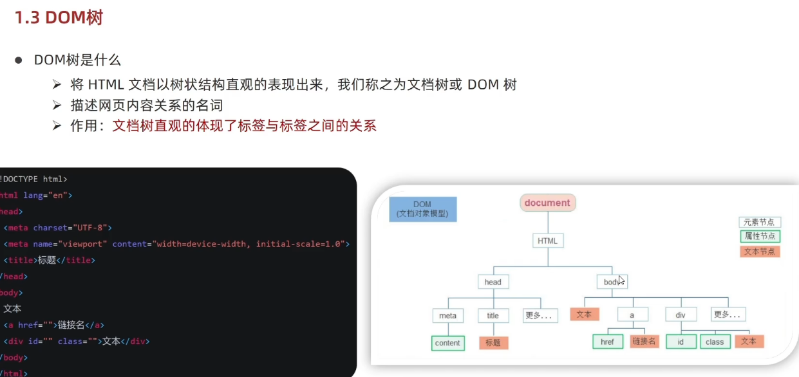
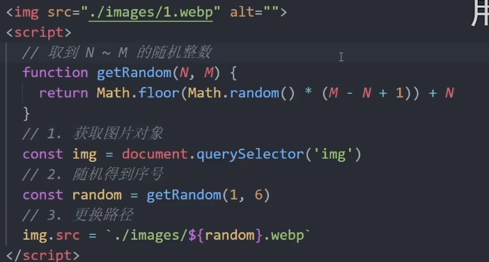

# JavaScript 笔记

## 一、JavaScript简介
### 1.1 JavaScript是什么？
是一种运行在客户端（浏览器）的编程语言，实现人机交互效果。
### 1.2 作用
- 网页特效（监听用户的一些行为让网页做出对应反馈）
- 表单验证（针对表单数据的合法性进行判断）
- 数据交互（获取后台数据，渲染到前端）
- 服务端编程（node.js）
### 1.3 组成
- ECMAScript：
  - 规定了JavaScript基础语法核心知识
- Web API：
  - DOM 操作文档，比如对页面元素进行移动、添加、删除等操作
  - BOM 操作浏览器，比如获取页面弹窗，检查窗口宽度、储存数据到浏览器等

## 二、基础格式
### 2.1 JavaScript 书写位置
1. 内部JavaScript
直接写在html文件里，用script标签包裹
**规范**：script标签写在body尾标签之上
```html
<body>
  ...
<script>
  alert("Hello, world!")
</script>
</body>
```
2. 外部JavaScript
代码写在以.js结尾的文件里
**语法**：通过script标签，引入到html页面中
```html
<body>
  ...
<script src="js/script.js"></script>
</body>
```
!此时写在script标签中间的代码会被忽略
3. 内联JavaScript
代码写在标签内部
**语法**：了解即可，vue框架会使用到
```html
<body>
  <button onclick="alert('Hello, world!')">Click me</button>
</body>
```
### 2.2 JavaScript写法
#### 2.2.1 注释
- 单行注释：
  * 符号：//
  * 快捷键：ctrl + /
- 块注释（多行注释）：
  * 符号：/* */
  * 快捷键：ctrl + shift + a
#### 2.2.2 结束符
- **作用**：使用英文“；”代表语句结束
- **实际情况**：可写可不写，只要统一风格即可
#### 2.2.3 输入输出语句
##### 2.2.3.1 输出语句
- **语法1**
  作用：向body内输出内容，如果写的内容是标签，也会被解析成网页元素，例如（'</br/>'）会被解析为一个换行符（去掉‘/’之后）
```javascript
document.write("要输出的内容")
```
- **语法2**
作用：页面弹出警告对话框
```javascript
alert("要输出的内容")
```
- **语法3**
作用：在控制台输出语法，程序员调试用
```javascript
console.log("要输出的内容")
```
##### 2.2.3.2 输入语句
- **语法**
作用：显示一个对话框，对话框中包含一条文字信息，用来提示用户输入文字
```javascript
prompt("请输入您的姓名：")
```
##### 2.2.3.3 代码执行顺序
- 按HTML文档流顺序执行JavaScript代码
- alert()和promot()它们会跳过页面渲染先被执行
##### 2.2.3.4 字面量
字面量是在计算机中描述 事/物
#### 2.2.4 变量
##### 2.2.4.1 变量的基本使用
1. 声明变量（即创建变量
  - 语法：
```JavaScript
let age（变量名）
```
age即变量名称，也叫标识符
2. 赋值变量
```JavaScript
let age = 25
```
3. 更新变量
```JavaScript
let age = 25
age = 30
```
！注意：let 不允许一次声明多个变量 

## 三、数据类型

### 3.1 基本数据类型
#### 3.1.1 数值型Number
#### 3.1.2 字符串型String
##### 3.1.2.1 一般字符串
##### 3.1.2.2 模块字符串

#### 3.1.3三种特殊数据类型
##### 3.1.3.1 boolean布尔类型
只有两个固定值：true和false
```JavaScript
let isCool=true
console.log(isCool)//返回true
```
true和false是布尔类型字面量
##### 3.1.3.2 undefined未定义类型
只声明变量但是不赋值，变量的值默认为undefined
```JavaScript
let age//声明变量但是未赋值
console.log(age)//返回undefined
```
##### 3.1.3.3 null空(空引用)类型
JavaScript中null仅仅是一个代表“无”、“空”或“未知值”的特殊值
```JavaScript
let age=null
console.log(age)//返回null
```
**使用场景**：将null作为尚未创建的对象，即有一个变量之后会存放一个对象，但是对象还没建好，先给个null占位
**与未定义的区别**：
- undefined表示没有赋值
- null表示赋了一个“空”值
```JavaScript
console.log(undefined + 1)//控制台输出NaN
console.log(null + 1)//控制台输出1
```
### 3.2 引用数据类型object

### 3.3 检测数据类型
**通过typeof**关键字检测数据类型
typeof运算符可以返回被检测的数据类型。支持两种语法形式：
- 作为运算符：**typeof x**
- 函数形式：typeof(x)
```JavaScript
console.log(typeof 123) // "number"
console.log(typeof "hello") // "string"
console.log(typeof true) // "boolean"
console.log(typeof undefined) // "undefined"
console.log(typeof null) // "object"
```
### 3.4 类型转换
JavaScript是弱数据类型，变量只有赋值后才能确定属于哪种数据类型。
**易错**：使用表单、prompt获取过来的数据默认是字符串类型的，此时不能直接简单的进行加法运算。
```JavaScript
console.log("123" + "456") // 输出结果"123456"
```
#### 3.4.1 隐式转换
某些运算符被执行时，系统内部自动将数据类型进行转换。
**规则**：
  - +号两边只要有一个是字符串，另一个就会被转换为字符串
  - **除了+以外**的算数运算符，比如-、*、/等都会把数据转成数字类型
**技巧**：
- **+号作为正号解析可以转换成字符型**
- **任何数据和字符串相加结果都是字符串**

#### 3.4.2 显式转换
##### 3.4.2.1 转换为数字型
1. **Number(数据)**：
   - 转成数字类型
   - 如果字符串里有非数字，转换结果为NaN(Not a Number)
   - NaN也是number类型的数据，代表非数字
2. **ParseInt(数据)**：只保留整数部分
3. **parseFloat(数据)**：可以保留小数部分

### 3.5 常见报错
1. const声明的常量未赋值(初始化)

2. 未声明变量报错

3. 重复声明变量报错

4. 常量改值

5. prompt未转型就计算


## 四、运算符
### 4.1 赋值运算符
对变量进行赋值，可以简化代码
符号：**=、+=、-=、*=、/=、%=、、、**
从右到左生效，变量等于原值与等号之后的值的运算结果
### 4.2 一元运算符
只需要一个操作数的运算符
- 符号：**+、-、++、--、!、typeof、void、delete**
- 前置（++i）\后置（i++）自增单独使用时：都是原变量的值加1，相当于num += 1
   **区别：**
   前置自增：先自增，再使用；
   后置自增：先使用，再自增。
```javaScript
let num1 = 1;
let num2 = 1;
console.log(++num1); // 输出结果2
console.log(num2++); // 输出结果1,完成输出后num2的值变为2
```
```javaScript
  let num1 = 1;
  console.log(i++ + ++i +i);//1+3+3=7,i++参与运算的值为1，但是i已经自增为2 
```
### 4.3 比较运算符

```JavaScript
console.log(10 < 20); // true
console.log(10==10); // true
//比较运算符有隐式转换，会把数据类型转换成数字类型再比较
console.log(2='2'); // true
//‘===’要求数据类型也一致才相等，推荐使用
console.log(2==='2')// false

console.log(undefined == null); // true
console.log(undefined === null); // false
console.log(NaN == '2'); // false
console.log(NaN === NaN); // false,NaN不等于自己在内的所有值

console.log(2!=='2'); // true,不完全相等
```
* **注意**：
  - 字符串相比较时，比较的是ASCII码
  - 从左到右一个字符一个字符比较
  - 所有涉及到NaN的比较运算，结果都是false
  - 小数有精度问题，不建议使用比较运算符
  - 不同数据类型比较时，会先转换成数字类型再比较
### 4.4 逻辑运算符

### 4.5 运算符优先级


## 五、语句
- 含义：
   - 表达式是一段可以求值的代码，JavaScript引擎会自动执行表达式，并返回结果。
   - 语句是一段可以执行的代码。
- 区别：
  - **表达式可被求值，可以放在赋值语句的右侧**
  - **语句不一定有值，比如alert（）、if语句、for语句等不能用于赋值**
- 程序三大流程控制语句：
   - 顺序结构：顺序执行代码，从上到下
   - 分支结构：根据条件选择执行的代码块，只有满足条件才执行
   - 循环结构：重复执行代码块，直到满足条件结束循环
### 5.1 分支语句
可以有选择性的执行需要的代码。
- 分支语句包含：if语句、三元运算符、switch语句
#### 5.1.1 if语句
1. 单分支
```JavaScript
  if(条件表达式){      //条件表达式为true时执行的代码,如果条件结果不是布尔类型，会隐式转换成布尔类型
    //满足条件执行的代码
    ...
  }                    //执行代码只有一行时，可以省略大括号
```
    - 除了0，所有数字都为真；
    - 除了空串，所有字符串都为真。
2. 双分支
```JavaScript
  if(条件表达式){
    //满足条件执行的代码
  }else{
    //不满足条件执行的代码
  }
```
3. 多分支
```JavaScript
  if(条件表达式1){
    //满足条件1执行的代码
  }else if(条件表达式2){
    //满足条件2执行的代码
  }
  ...
  else{
    //不满足条件1...和条件n执行的代码
  }
```
#### 5.1.2 三元运算符
**使用场景**：其实是if双分支的更简单写法，一般用来取值
```JavaScript
  //条件？满足条件式执行的代码：不满足条件执行的代码
  console.log(3>5? 10 : 20); // 输出结果20
```
#### 5.1.3 switch语句
**作用**：根据表达式的值，选择执行相应的代码块。
```JavaScript
  switch(表达式){
    case 值1:           //必须要与case后面的值全等（===）
      //执行代码块1
      break;
    case 值2:
      //执行代码块2
      break;
    ...
    default:
      //如果没有匹配的值，执行默认代码块
      break;
  }
```
**特点**：
   - switch case语句一般用于等值判断，不适合于区间判断
   - switch case一般要配合break关键字使用，没有break会造成case穿透
### 5.2 循环语句
- 断点调试（浏览器控制台旁source可以设置断点）：在循环语句中设置断点，可以方便的查看循环的执行过程。
#### 5.2.1 while循环
```JavaScript
let i=0                 //变量起始值
  while(i<10){          //终止条件
    console.log(i)      //循环体
    i++                 //变量变化值
  }
```
- while循环三要素：**变量起始值、终止条件、变量变化值**
#### 5.2.2 退出循环
- break语句：跳出当前循环，继续执行后续代码
- continue语句：跳过当前循环，继续执行下一次循环
```JavaScript
  let i=1
  while(i<=12){
    if(i==5){
      i++             //必写，否则会陷入死循环
      continue
    }                //跳过当前循环
    console.log(i)
    i++
    if(i=11) break    //退出整个循环
  }
  //输出结果：1 2 3 4 6 7 8 9 10
```

#### 6 逻辑中断
- 符号：||、&&
- 规则：
```JavaScript
// 逻辑或：左边为true就短路，右边不执行
console.log(true || false); // true
// 逻辑与：左边为false就短路，右边不执行
console.log(false && true); // false
// 最终执行结果都是右边的表达式值
```
#### 6.2 转换成布尔类型
1. 显式转换：
**''、0、null、undefined、false、NaN**转成**false**；其他值转成true
```JavaScript
console.log(false && 20); // false
console.log(5<3 && 20); // false
console.log(null && 20); // null
console.log(0 && 10); // 0
```
2. 隐式转换
- 有字符串的加法“ ”+1，结果为字符串“1”
- 减法-只能用于数字，会使空字符串转换成0
- null经数字转换之后为0
- undefined经数字转换之后为NaN

## 六、对象
### 6.1 声明对象
- 语法：
```JavaScript
let 对象名 = {
  属性名1: 值1,
  属性名2: 值2,
  ...
  方法名1: function(){
    //方法体
  },
  ...
}
```
### 6.2 操作对象
1. 访问对象属性
- 语法：对象名.属性名
2. 修改对象属性
- 语法：对象名.属性名 = 新值
- 注意:属性名可以使用''或""，**一般省略**，除非名称遇到特殊符号如空格、中横线等
3. 调用对象方法
- 语法：对象名.方法名()
- 注意:方法名可以使用''或""，**一般省略**，除非名称遇到特殊符号如空格、中横线等
```Javascript
  let obj={
    //属性
    name:'xioaxiao',
    //方法（放对象外就叫函数）
    song:function(){
      console.log('歌曲')
    }
  }
  //调用方法
  obj.song() // 输出结果：歌曲
```
4. 遍历对象属性
```JavaScript
  let obj={
    name:'xioaxiao',
    age:25,
    sex:'男'
  }
  //遍历对象属性-循环
  for(let key in obj){
    console.log(key)//输出属性名
    console.log(obj[key])//输出属性值 ,[key]相当于['name']
    console.log(obj['name']) //输出name属性值
  }
```
### 6.3 内置对象-Math
- javascript内置对象Math,包含很多数学计算相关的函数
- Math包含方法：
  - random()：返回0-1之间的随机数
  - ceil(x)：返回大于或等于x的最小整数
  - floor(x)：返回小于或等于x的最大整数
  - round(x)：返回x四舍五入后的整数
  - max:返回多个数中的最大值
  - min:返回多个数中的最小值
  - pow(x,y)：返回x的y次方
  - abs(x)：返回x的绝对值
- 生成任意范围随机数
```JavaScript
  Math.floor(Math.random() * (M-N+1))+N //N-M之间的随机整数
```
### 6.4 拓展
#### 6.4.1 术语

#### 6.4.2 数据拓展知识
1. 简单（基本/值）数据类型：Number、String、Boolean、、、
   -存放到栈里
2. 复杂（引用）数据类型：Object、Array、Function、Date、RegExp、、、
   -存放到堆里

## 七、API
优先使用const声明数组或对象。
### 7.1 DOM-文档对象模型
-DOM树

#### 7.1.1 获取页面标签
1. 基础方法：
- document.querySelector('css选择器') 
  - 参数：一个或多个CSS选择器
  - 返回值：CSS选择器匹配的第一个元素，一个HTMLElement对象
  - 可以直接修改元素属性
```html
<body>
  <div class="box">123</div>
  <div class="box">ab3</div>
  <p id="nav">456</p>
  <script>
    const nav = document.querySelector('#nav')
    console.log(nav) // 输出结果：456
    nav.style.color ='red' // 修改元素属性
  </script>
</body>
```
- document.querySelectorAll('css选择器') 
  - 参数：一个或多个CSS选择器 字符串
  - 返回值：CSS选择器匹配的NodeList对象集合
  - 通过遍历(for)NodeList对象集合，修改元素属性
```html
<body>
  <div class="box">123</div>
  <div class="box">ab3</div>
  <p id="nav">456</p>
  <ul id="list">
    <li>1</li>
    <li>2</li>
    <li>3</li>
  </ul>
  <script>
    const lis = document.querySelectorAll('ul li')
    console.log(lis) // 输出结果：li元素的NodeList对象集合

    for(let i=0;i<lis.length;i++){
      lis[i].style.color = 'blue' // 修改元素属性
    }
    const p = document.querySelectorAll('#list')//与lis本质相同
    p[0].style.color = 'green' // 修改单个元素属性
    </script>
</body>
```
2. 高级方法：
- document.getElementById('id')
  - 参数：元素的id属性值
- - document.getElementByTagName('div')
  - 参数：标签名
  - 获取到页面所有div标签
- - document.getElementByClassName('w')
  - 参数：类名
##### 7.1.2 操作元素内容
1. 操作innerText文字内容
- 将文本内容添加/更新到任意标签位置
- 显示为纯文本，不解析标签
2. **操作innerHTML属性**
- 将文本内容添加/更新到任意标签位置
- 显示为文本，会解析标签，多标签建议使用模版字符
##### 7.1.3 操作元素属性
1. 常用属性
**语法**：对象.属性名 = '值'

2. 样式属性
- 通过style属性操作CSS
**语法**：对象.style.属性名 = '值'
- 通过（className）操作css
```html
</title>
  <style>
    div {
      width: 50px;
      height: 50px;
      background-color: red;
    }

   .box{
      width: 100px;
      height: 100px;
      background-color: red;
    }
  </style>
  <body>
    <div></div>
    <script>
      const div = document.gquerySelector('div')
      div.className = 'box'    //新值换旧值，同时也会覆盖之前的类名
    </script>
```
- 通过classList操作类控制css
通过classList方式追加和删除类名，不会覆盖之前的类名
    - 追加一个类
    元素.classList.add('类名')
    - 移除一个类
    元素.classList.remove('类名')
    - 切换一个类(有就替换，没有就添加)
    元素.classList.toggle('类名')
```html
</title>
  <style>
    .box1 {
      width: 50px;
      height: 50px;
      background-color: red;
    }

   .box2 {
      width: 100px;
      height: 100px;
      background-color: red;
    }
  </style>
  <body>
    <div class="box"></div>
    <script>
      const box = document.querySelector('.box')
      div.classList.add('box1')    //类名='box box1'
      div.classList.remove('box') //类名=''
      div.classList.toggle('box2') //原本有就移除，没有就添加
    </script>
```
3. 表单元素属性
4. 自定义属性
### 7.2 BOM-浏览器对象模型
### 7.3 事件监听
#### 7.3.1 
- **语法**：对象.addEventListener('事件类型',要执行的函数)
  （！事件类型要加引号；函数是点击之后执行，且点击一次执行一次）