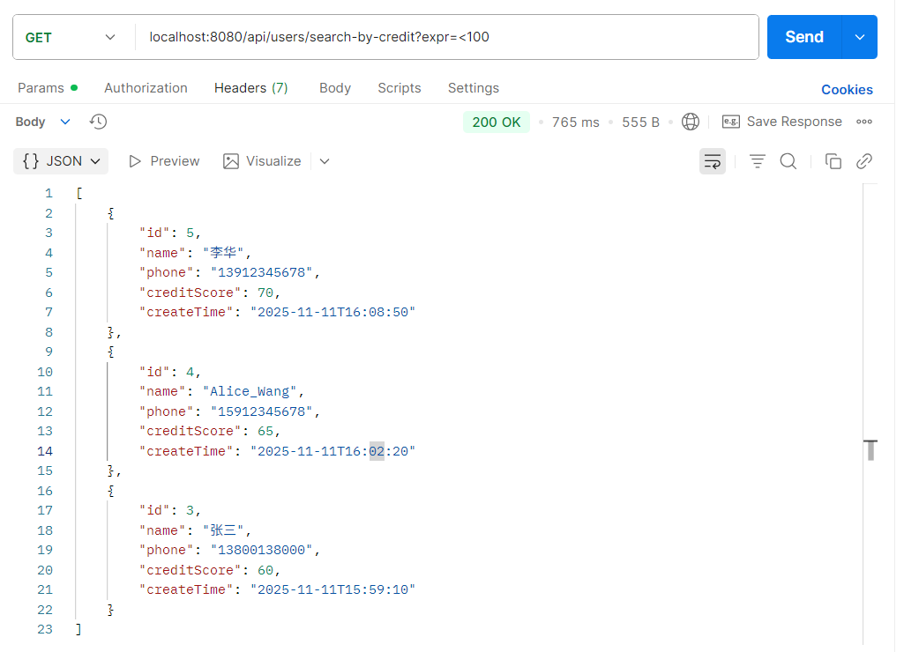
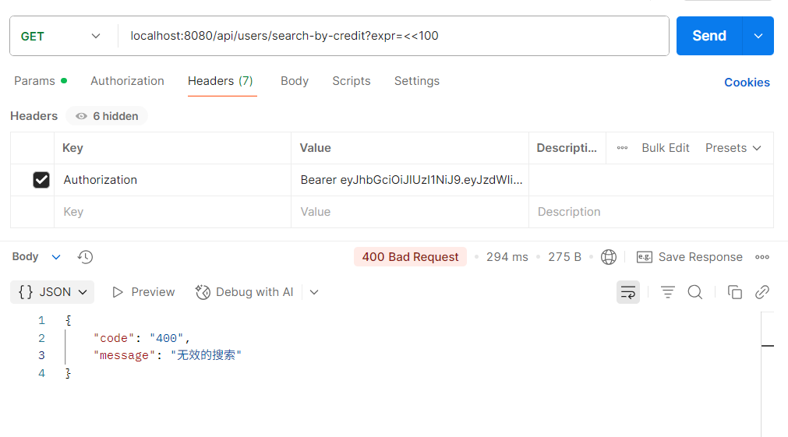

# 用户接口说明

## 增加用户

## 删除用户

## 修改用户信息

## 查询用户

## 根据信誉分从高到低查询用户

**网址：**/api/users/search-by-credit

**请求方式：** GET

**请求参数：**

|字段名|类型|是否必填|说明|示例值|
|---|---|---|---|---|
| expr |  String  |  是  | 信仰分筛选表达式，支持>,<,>=,<=,=  |  <100  |

**请求实例（网址）：** /api/users/search-by-credit?expr=<100

**返回数据：**

``` json
[
  {
    "id": 5,
    "name": "李华",
    "phone": "13912345678",
    "creditScore": 70,
    "createTime": "2025-11-11T16:08:50"
  },
  {
    "id": 4,
    "name": "Alice_Wang",
    "phone": "15912345678",
    "creditScore": 65,
    "createTime": "2025-11-11T16:02:20"
  },
  {
    "id": 3,
    "name": "张三",
    "phone": "13800138000",
    "creditScore": 60,
    "createTime": "2025-11-11T15:59:10"
  }
]
```

**postman测试：**


