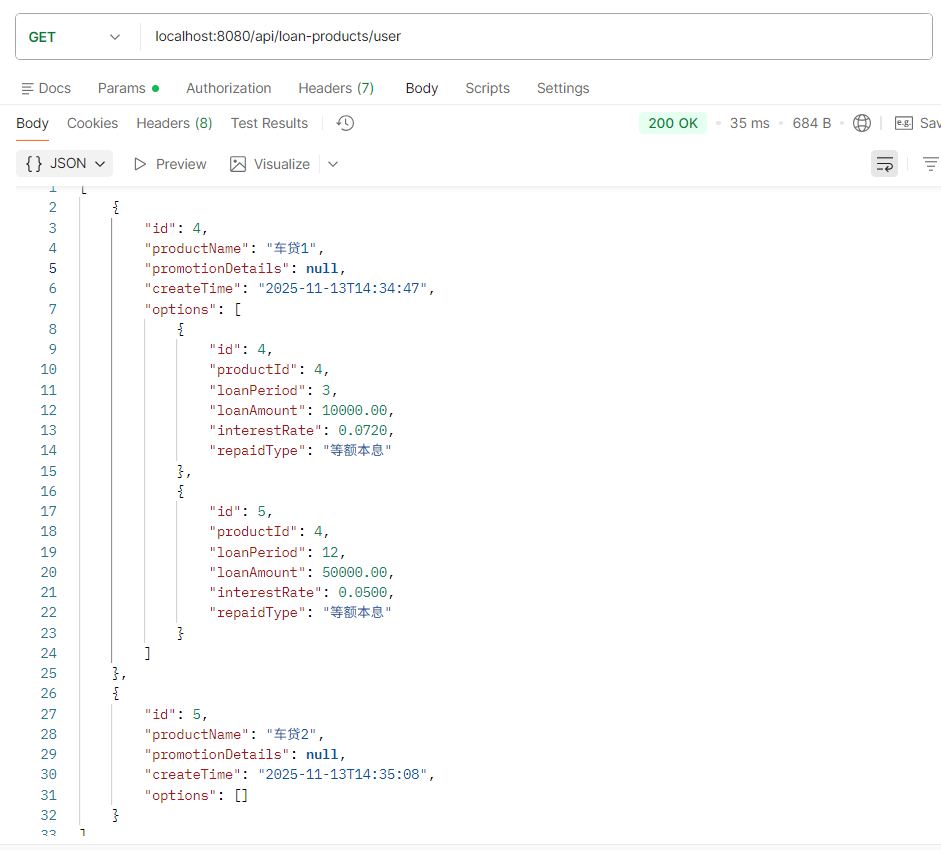
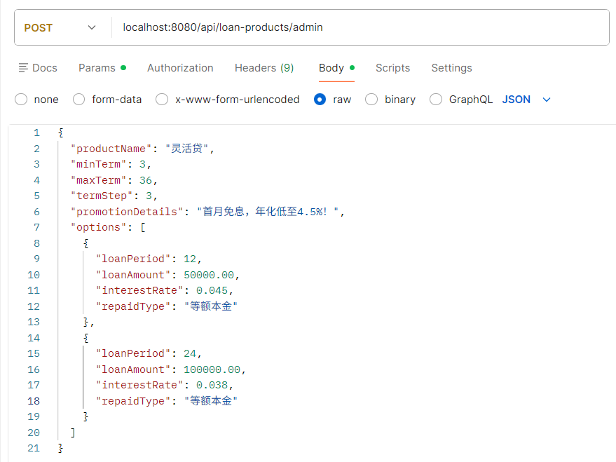
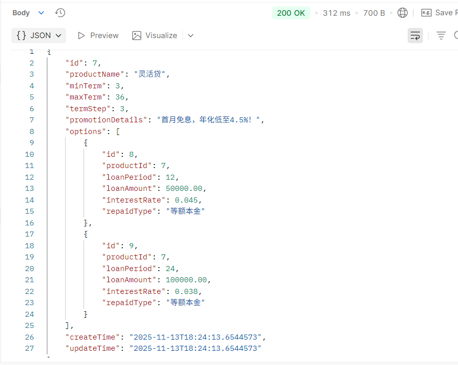
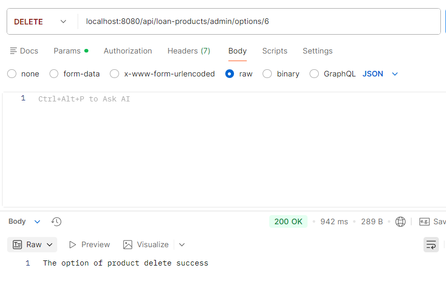
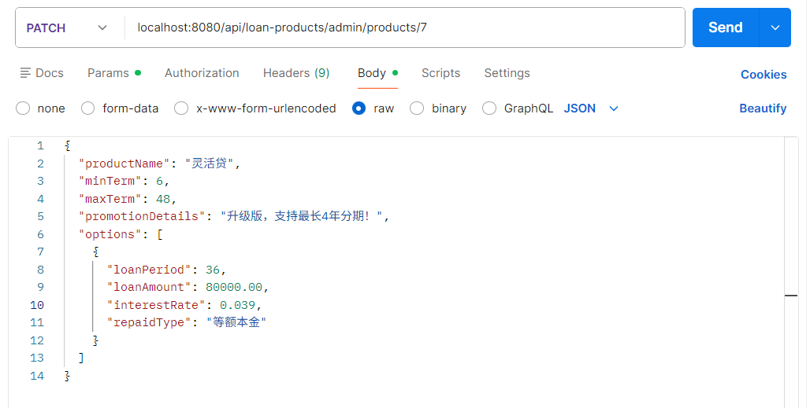
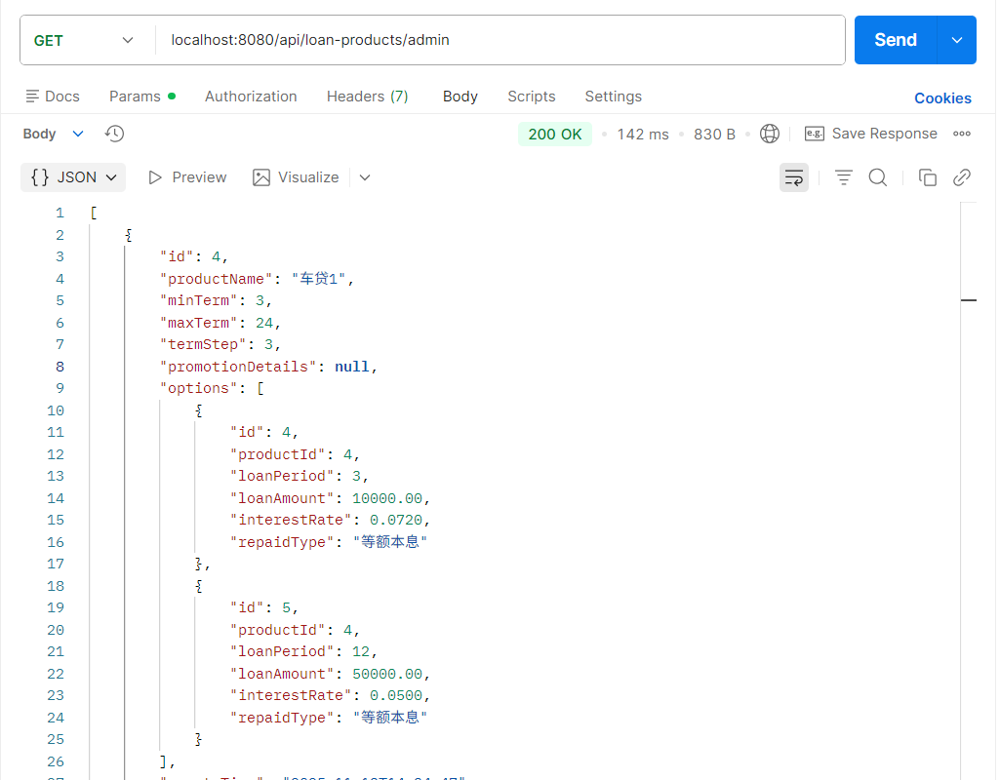
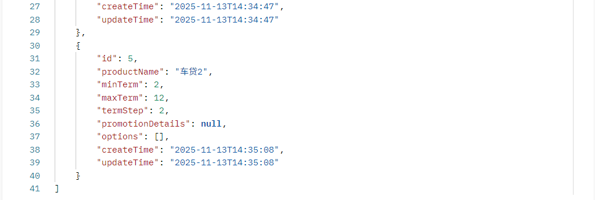
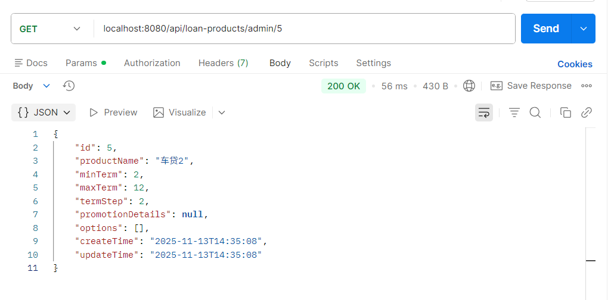

# 贷款产品接口说明

以下接口请求时都需携带请求头，实例：

| 字段 | 值  | 说明 |
| --   | -- | -- |
| Authorization | Bearer token | 需携带有效token |

## 用户功能

### 查看所有贷款产品

**网址：**/api/loan-products/user

**请求方式：** GET

**返回数据：**

``` json
[
    {
        "id": 4,
        "productName": "车贷1",
        "promotionDetails": null,
        "createTime": "2025-11-13T14:34:47",
        "options": [
            {
                "id": 4,
                "productId": 4,
                "loanPeriod": 3,
                "loanAmount": 10000,
                "interestRate": 0.072,
                "repaidType": "等额本息"
            },
            {
                "id": 5,
                "productId": 4,
                "loanPeriod": 12,
                "loanAmount": 50000,
                "interestRate": 0.05,
                "repaidType": "等额本息"
            }
        ]
    },
    {
        "id": 5,
        "productName": "车贷2",
        "promotionDetails": null,
        "createTime": "2025-11-13T14:35:08",
        "options": []
    }
]
```

**postman测试：**



## 管理员功能

### 增加贷款产品

**网址：**/api/loan-products/admin

**请求方式**：POST

**请求参数：**

|字段名|类型|是否必填|说明|示例值|
|---|---|---|---|---|
|productName|String|是|贷款产品名称|车贷1|
|minTerm|Integer|是|最短借款期限（单位：月）| |
|maxTerm|Integer|是|最长借款期限（单位：月）| |
|termStep|Integer|是|期限递增步长（单位：月），例如每3个月一档|  |
|promotionDetails|String|否|促销描述，用于展示给用户|   |
|options|Array[Object]|是|可选方案列表，每个选项代表一种贷款组合|  |

**options集合中的参数说明：**

|字段名|类型|是否必填|说明|示例值|
|---|---|---|---|---|
|loanPeriod|Integer|是|贷款期限（单位：月）|  |
|loanAmount|BigDecimal|是|贷款额度（单位：元）|   |
|interestRate|BigDecimal|是|年化利率（小数形式，如 0.045 表示 4.5%）|     |
|repaidType|String|是|还款方式，目前支持："等额本金"、"等额本息" 、"一次性还本付息"|   |

**请求示例（请求体）：**

``` json
{
  "productName": "灵活贷",
  "minTerm": 3,
  "maxTerm": 36,
  "termStep": 3,
  "promotionDetails": "首月免息，年化低至4.5%！",
  "options": [
    {
      "loanPeriod": 12,
      "loanAmount": 50000.00,
      "interestRate": 0.045,
      "repaidType": "等额本金"
    },
    {
      "loanPeriod": 24,
      "loanAmount": 100000.00,
      "interestRate": 0.038,
      "repaidType": "等额本金"
    }
  ]
}
```

**返回数据：**

``` json
{
  "id": 7,
  "productName": "灵活贷",
  "minTerm": 3,
  "maxTerm": 36,
  "termStep": 3,
  "promotionDetails": "首月免息，年化低至4.5%！",
  "options": [
    {
      "id": 8,
      "productId": 7,
      "loanPeriod": 12,
      "loanAmount": 50000.00,
      "interestRate": 0.045,
      "repaidType": "等额本金"
    },
    {
      "id": 9,
      "productId": 7,
      "loanPeriod": 24,
      "loanAmount": 100000.00,
      "interestRate": 0.038,
      "repaidType": "等额本金"
    }
  ],
  "createTime": "2025-11-13T18:24:13.6544573",
  "updateTime": "2025-11-13T18:24:13.6544573"
}
```

**postman测试结果：**




### 删除产品

**网址：**/api/loan-products/admin/products/{productId}

**请求方式**：DELETE

**请求参数：**

|字段名|类型|是否必填|说明|示例值|
|---|---|---|---|---|
|productId|Long|是|产品Id|6|

**请求示例（网址）：**/api/loan-products/admin/products/6

**返回数据(返回字符串)：**
Loan product delete success

**postman测试结果：**


### 删除指定产品的选项

**网址：**/api/loan-products/admin/options/{optionId}

**请求方式：** DELETE

**请求参数：**

|字段名|类型|是否必填|说明|示例值|
|---|---|---|---|---|
|optionId|Long|是|指定产品的选项Id|6|

**请求示例（网址）**：/api/loan-products/admin/options/6

**返回数据（返回字符串）：** The option of product delete success

**postman测试结果：**



### 修改产品信息

**网址**：/api/loan-products/admin/products/{productId}

**请求方式：** PATCH

**请求参数（可选）：**

|字段名|类型|是否必填|说明|示例值|
|---|---|---|---|---|
|productName|String|否| 产品名称 |    |
|minTerm|Integer|否|最短借款期限（单位：月）|    |
|maxTerm|Integer|否|最长借款期限（单位：月）|   |
|termStep|Integer|否|期限递增步长（单位：月）|   |
|promotionDetails|String|否|促销文案|   |
|options|Array[Object]|否|可选方案列表|   |

**options 中的字段说明：**

|字段名|类型|是否必填|说明|示例值|
|---|---|---|---|---|
|loanPeriod|Integer|是|贷款期限（单位：月）|   |
|loanAmount|Number|是|贷款额度（单位：元）|   |
|interestRate|Number|是|年化利率（小数形式，如 0.039 表示 3.9%）|   |
|repaidType|String|是|还款方式，"等额本金"、"等额本息"、"一次性还本付息"|  |

**请求示例（网址）：**/api/loan-products/admin/products/7

**请求示例（请求体）：**

``` json
{
  "productName": "灵活贷",
  "minTerm": 6,
  "maxTerm": 48,
  "termStep": 3,
  "promotionDetails": "升级版，支持最长4年分期！",
  "options": [
    {
      "loanPeriod": 36,
      "loanAmount": 80000.00,
      "interestRate": 0.039,
      "repaidType": "等额本金"
    }
  ]
}
```

**返回数据：**

``` json
{
  "id": 7,
  "productName": "灵活贷",
  "minTerm": 6,
  "maxTerm": 48,
  "termStep": 3,
  "promotionDetails": "升级版，支持最长4年分期！",
  "options": [
    {
      "id": 12,
      "productId": 7,
      "loanPeriod": 36,
      "loanAmount": 80000.00,
      "interestRate": 0.039,
      "repaidType": "等额本金"
    }
  ],
  "createTime": "2025-11-13T18:24:13",
  "updateTime": "2025-11-13T19:11:13.1746693"
}
```

**postman测试结果：**



### 获取所有产品

**网址：**/api/loan-products/admin

**请求方式：** GET

**返回数据：**

``` json
[
    {
        "id": 4,
        "productName": "车贷1",
        "minTerm": 3,
        "maxTerm": 24,
        "termStep": 3,
        "promotionDetails": null,
        "options": [
            {
                "id": 4,
                "productId": 4,
                "loanPeriod": 3,
                "loanAmount": 10000,
                "interestRate": 0.072,
                "repaidType": "等额本息"
            },
            {
                "id": 5,
                "productId": 4,
                "loanPeriod": 12,
                "loanAmount": 50000,
                "interestRate": 0.05,
                "repaidType": "等额本息"
            }
        ],
        "createTime": "2025-11-13T14:34:47",
        "updateTime": "2025-11-13T14:34:47"
    },
    {
        "id": 5,
        "productName": "车贷2",
        "minTerm": 2,
        "maxTerm": 12,
        "termStep": 2,
        "promotionDetails": null,
        "options": [],
        "createTime": "2025-11-13T14:35:08",
        "updateTime": "2025-11-13T14:35:08"
    }
]
```

**postman测试结果：**




### 获取指定产品

**网址：**/api/loan-products/admin/{productId}

**请求方式：** GET

**请求参数：**

|字段名|类型|是否必填|说明|示例值|
|---|---|---|---|---|
|productId|Long|是|产品Id|5|

**请求示例（网址）**：/api/loan-products/admin/5

**返回数据：**

``` json
{
    "id": 5,
    "productName": "车贷2",
    "minTerm": 2,
    "maxTerm": 12,
    "termStep": 2,
    "promotionDetails": null,
    "options": [],
    "createTime": "2025-11-13T14:35:08",
    "updateTime": "2025-11-13T14:35:08"
}
```

**postman测试结果：**

