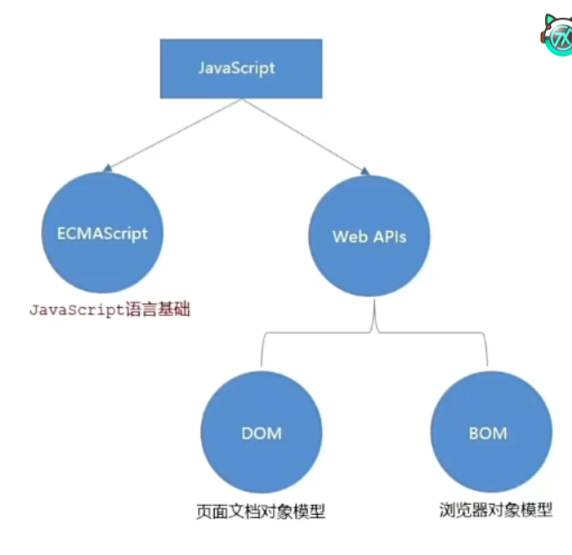
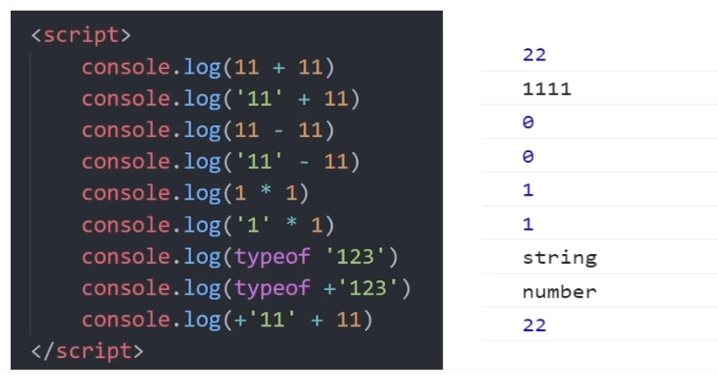
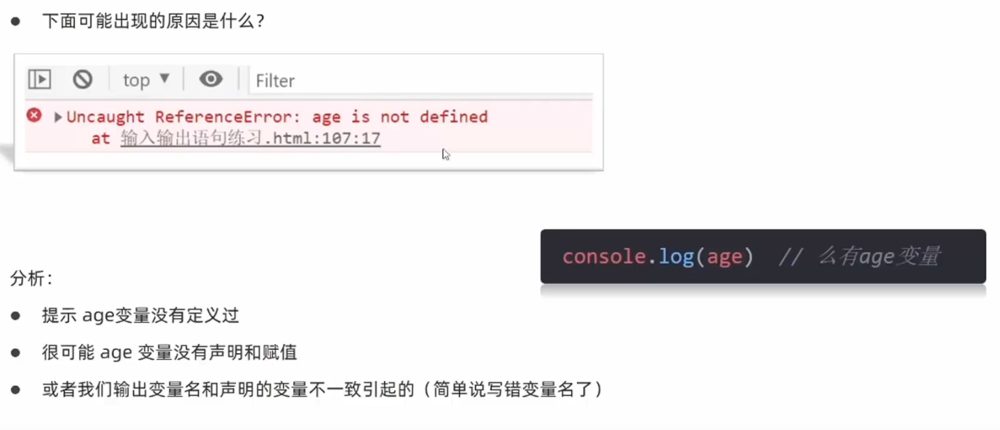
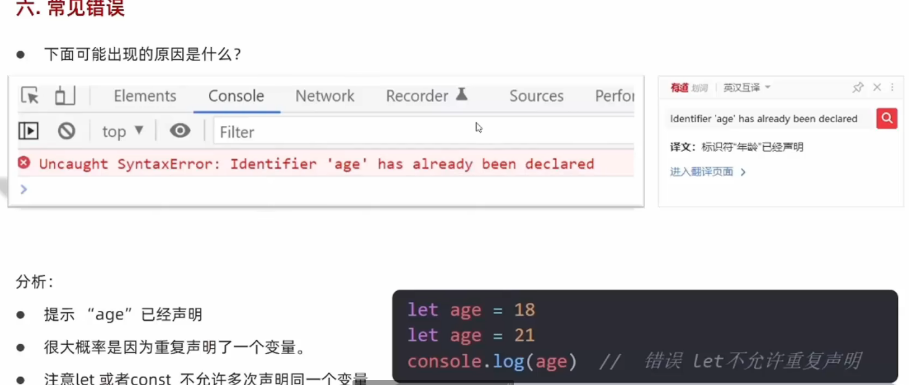
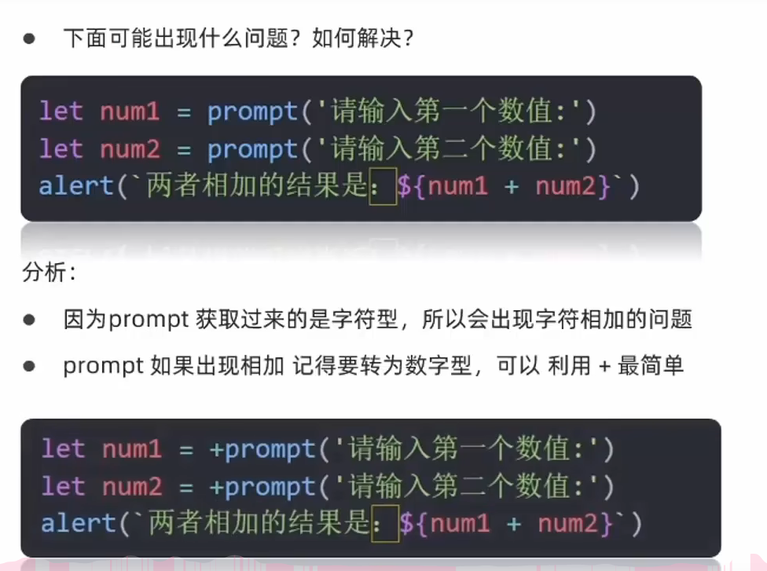

# JavaScript 笔记

## 一、JavaScript简介
### 1.JavaScript是什么？
是一种运行在客户端（浏览器）的编程语言，实现人机交互效果。
### 2.作用
- 网页特效（监听用户的一些行为让网页做出对应反馈）
- 表单验证（针对表单数据的合法性进行判断）
- 数据交互（获取后台数据，渲染到前端）
- 服务端编程（node.js）
### 3.组成
- ECMAScript：
  - 规定了JavaScript基础语法核心知识
- Web API：
  - DOM 操作文档，比如对页面元素进行移动、添加、删除等操作
  - BOM 操作浏览器，比如获取页面弹窗，检查窗口宽度、储存数据到浏览器等

## 二、基础格式
### 1.JavaScript 书写位置
1. 内部JavaScript
直接写在html文件里，用script标签包裹
**规范**：script标签写在body尾标签之上
```html
<body>
  ...
<script>
  alert("Hello, world!")
</script>
</body>
```
2. 外部JavaScript
代码写在以.js结尾的文件里
**语法**：通过script标签，引入到html页面中
```html
<body>
  ...
<script src="js/script.js"></script>
</body>
```
!此时写在script标签中间的代码会被忽略
3. 内联JavaScript
代码写在标签内部
**语法**：了解即可，vue框架会使用到
```html
<body>
  <button onclick="alert('Hello, world!')">Click me</button>
</body>
```
### 2.JavaScript写法
#### 2.1 注释
- 单行注释：
  * 符号：//
  * 快捷键：ctrl + /
- 块注释（多行注释）：
  * 符号：/* */
  * 快捷键：ctrl + shift + a
#### 2.2 结束符
- **作用**：使用英文“；”代表语句结束
- **实际情况**：可写可不写，只要统一风格即可
#### 2.3 输入输出语句
##### 2.3.1 输出语句
- **语法1**
  作用：向body内输出内容，如果写的内容是标签，也会被解析成网页元素，例如（'</br/>'）会被解析为一个换行符（去掉‘/’之后）
```javascript
document.write("要输出的内容")
```
- **语法2**
作用：页面弹出警告对话框
```javascript
alert("要输出的内容")
```
- **语法3**
作用：在控制台输出语法，程序员调试用
```javascript
console.log("要输出的内容")
```
##### 2.3.2 输入语句
- **语法**
作用：显示一个对话框，对话框中包含一条文字信息，用来提示用户输入文字
```javascript
prompt("请输入您的姓名：")
```
##### 2.3.3 代码执行顺序
- 按HTML文档流顺序执行JavaScript代码
- alert()和promot()它们会跳过页面渲染先被执行
##### 2.3.4 字面量
字面量是在计算机中描述 事/物
#### 2.4 变量
##### 2.4.1 变量的基本使用
1. 声明变量（即创建变量
  - 语法：
```JavaScript
let age（变量名）
```
age即变量名称，也叫标识符
2. 赋值变量
```JavaScript
let age = 25
```
3. 更新变量
```JavaScript
let age = 25
age = 30
```
！注意：let 不允许一次声明多个变量 

## 三、数据类型

### 1.基本数据类型
#### 1.1 数值型Number
#### 1.2 字符串型String
##### 1.2.1 一般字符串
##### 1.2.2 模块字符串

#### 1.3三种特殊数据类型
##### 1.3.1 boolean布尔类型
只有两个固定值：true和false
```JavaScript
let isCool=true
console.log(isCool)//返回true
```
true和false是布尔类型字面量
##### 1.3.2 undefined未定义类型
只声明变量但是不赋值，变量的值默认为undefined
```JavaScript
let age//声明变量但是未赋值
console.log(age)//返回undefined
```
##### 1.3.3 null空(空引用)类型

JavaScript中null仅仅是一个代表“无”、“空”或“未知值”的特殊值
```JavaScript
let age=null
console.log(age)//返回null
```
**使用场景**：将null作为尚未创建的对象，即有一个变量之后会存放一个对象，但是对象还没建好，先给个null占位
**与未定义的区别**：
- undefined表示没有赋值
- null表示赋了一个“空”值
```JavaScript
console.log(undefined + 1)//控制台输出NaN
console.log(null + 1)//控制台输出1
```
### 2.引用数据类型object

### 3.检测数据类型
**通过typeof**关键字检测数据类型
typeof运算符可以返回被检测的数据类型。支持两种语法形式：
- 作为运算符：**typeof x**
- 函数形式：typeof(x)
```JavaScript
console.log(typeof 123) // "number"
console.log(typeof "hello") // "string"
console.log(typeof true) // "boolean"
console.log(typeof undefined) // "undefined"
console.log(typeof null) // "object"
```
### 4.类型转换
JavaScript是弱数据类型，变量只有赋值后才能确定属于哪种数据类型。
**易错**：使用表单、prompt获取过来的数据默认是字符串类型的，此时不能直接简单的进行加法运算。
```JavaScript
console.log("123" + "456") // 输出结果"123456"
```
#### 4.1 隐式转换
某些运算符被执行时，系统内部自动将数据类型进行转换。
**规则**：
  - +号两边只要有一个是字符串，另一个就会被转换为字符串
  - **除了+以外**的算数运算符，比如-、*、/等都会把数据转成数字类型
**技巧**：
- **+号作为正号解析可以转换成字符型**
- **任何数据和字符串相加结果都是字符串**

#### 4.2 显式转换
##### 4.2.1 转换为数字型
1. **Number(数据)**：
   - 转成数字类型
   - 如果字符串里有非数字，转换结果为NaN(Not a Number)
   - NaN也是number类型的数据，代表非数字
2. **ParseInt(数据)**：只保留整数部分
3. **parseFloat(数据)**：可以保留小数部分

### 5.常见报错
1. const声明的常量未赋值(初始化)

2. 未声明变量报错

3. 重复声明变量报错

4. 常量改值

5. prompt未转型就计算


## 四、运算符
### 1.赋值运算符
### 2.一元运算符
### 3.比较运算符
### 4.逻辑运算符
### 5.运算符优先级