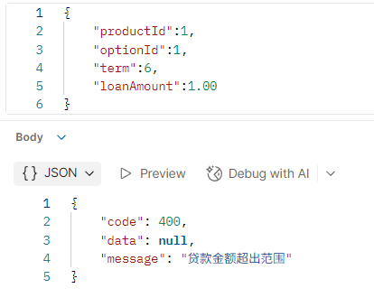
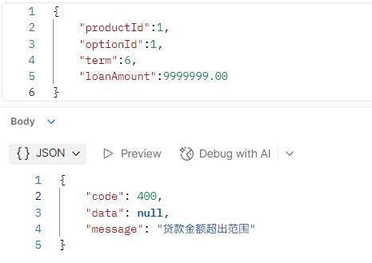

# 贷款申请相关接口说明

以下接口请求时都需携带请求头，示例：

| 字段 | 值  | 说明 |
| --   | -- | -- |
| Authorization | Bearer token | 需携带有效token |

## 用户使用

### 申请贷款

**网址** /api/loan-applications

**请求方式** POST

**请求参数**:

|字段名|类型|是否必填|说明|示例值|
|---|---|---|---|---|
|productId|integer|是|产品id|1|
|optionId|integer|是|产品某选项id|3|
|term|integer|是|用户选择的期数，只能从产品指定的terms数组里选择|6|
|loanAmount|number|是|用户贷款的金额，不能高于最高额度，低于最低额度|5000.00|

**请求示例（请求体）**:

``` json
{
    "productId":1,
    "optionId":1,
    "term":6,
    "loanAmount":5000.00
}
```

返回数据

``` json
{
    "code": 200,
    "data": "Application submitted successfully, please wait for review",
    "message": "操作成功"
}
```

**postman测试结果** :

**成功**：


**失败**:




**日志**:


### 查看单个申请详情

**网址** /api/loan-applications/my/{applicationId}

**请求方式** GET

**请求参数**:

|字段名|类型|是否必填|说明|示例值|
|---|---|---|---|---|
|applicationId|integer|是|申请id|1|

**请求示例（网址）** /api/loan-applications/my/1

**返回数据**:

``` json
{
    "code": 200,
    "data": {
        "id": 9,
        "userId": 10,
        "productId": 1,
        "status": "AI拒绝",
        "loanAmount": 5000.00,
        "interestRate": 0.0390,
        "loanPeriod": 24,
        "term": 6,
        "repaidType": "等额本息",
        "rejectReason": "AI审核未通过\n",
        "applyTime": "2026-03-10 21:51:26",
        "reviewTime": null
    },
    "message": "操作成功"
}
```

**postman测试结果**:


**日志**:


### 查看所有申请

**网址** /api/loan-applications/my

**请求方式** GET

**返回数据**:

``` json
{
    "code": 200,
    "data": [
        {
            "applicationId": 10,
            "productName": "优享贷",
            "loanAmount": 5000.00,
            "status": "已通过",
            "applyTime": "2026-03-10 21:51:27",
            "rejectReason": null
        },
        {
            "applicationId": 9,
            "productName": "优享贷",
            "loanAmount": 5000.00,
            "status": "AI拒绝",
            "applyTime": "2026-03-10 21:51:26",
            "rejectReason": "AI审核未通过\n"
        },
        {
            "applicationId": 8,
            "productName": "优享贷",
            "loanAmount": 5000.00,
            "status": "已通过",
            "applyTime": "2026-03-10 21:51:24",
            "rejectReason": null
        },
        {
            "applicationId": 7,
            "productName": "优享贷",
            "loanAmount": 5000.00,
            "status": "已通过",
            "applyTime": "2026-03-10 21:51:23",
            "rejectReason": null
        },
        {
            "applicationId": 6,
            "productName": "优享贷",
            "loanAmount": 5000.00,
            "status": "AI拒绝",
            "applyTime": "2026-03-10 21:51:21",
            "rejectReason": "AI审核未通过\n"
        }
    ],
    "message": "操作成功"
}
```

**postman测试结果**:


**日志**:


### 撤回/取消申请

**网址** /api/loan-applications/my/{applicationId}/withdraw

**请求方式** POST

**请求参数** :

|字段名|类型|是否必填|说明|示例值|
|---|---|---|---|---|
| applicationId | integer | 是 | 申请id | 3 |

**请求示例（网址）** /api/loan-applications/my/3/withdraw

**返回数据**:

``` json
{
    "code": 200,
    "data": null,
    "message": "操作成功"
}
```

**postman测试结果**:


**日志**:


