# 贷款申请相关接口说明

以下接口请求时都需携带请求头，实例：

| 字段 | 值  | 说明 |
| --   | -- | -- |
| Authorization | Bearer token | 需携带有效token |

## 用户使用

### 申请贷款

**网址** /api/loan-applications

**请求方式** POST

**请求参数**:

|字段名|类型|是否必填|说明|示例值|
|---|---|---|---|---|
| productId | integer | 是 | 产品id | 1 |
| optionId |  integer | 是 | 产品某选项id | 3 |
| term  | integer  |  是  | 用户选择的期数，只能从产品指定的terms数组里选择 | 6 |

**请求示例（请求体）**:

``` json
{
    "productId":1,
    "optionId":3,
    "term":6
}
```

返回数据

``` json
{
    "code": 200,
    "data": "Application submitted successfully, please wait for review",
    "message": "操作成功"
}
```

**postman测试结果** :

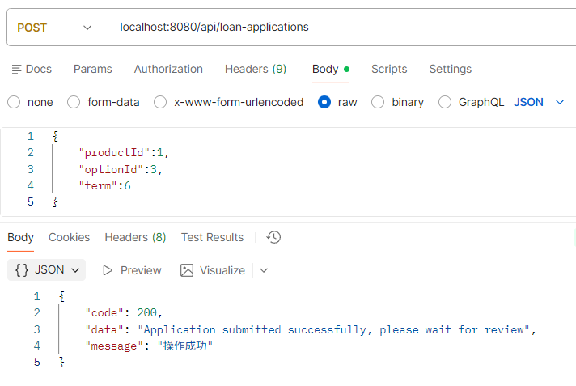

**日志**:

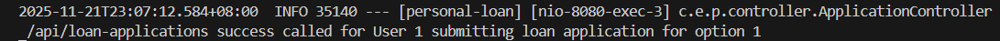

### 查看单个申请

**网址** /api/loan-applications/my/{applicationId}

**请求方式** GET

**请求参数**:

|字段名|类型|是否必填|说明|示例值|
|---|---|---|---|---|
| applicationId | integer | 是 | 申请id | 4 |

**请求示例（网址）** /api/loan-applications/my/4

**返回数据**:

``` json
{
    "code": 200,
    "data": {
        "applicationId": 4,
        "productName": "优享贷",
        "loanAmount": 150000,
        "interestRate": 0.043,
        "loanPeriod": 60,
        "term": 6,
        "repaidType": "等额本息",
        "status": "PENDING",
        "applyTime": "2025-11-22T15:03:42",
        "reviewTime": null,
        "rejectReason": null
    },
    "message": "操作成功"
}
```

**postman测试结果**:

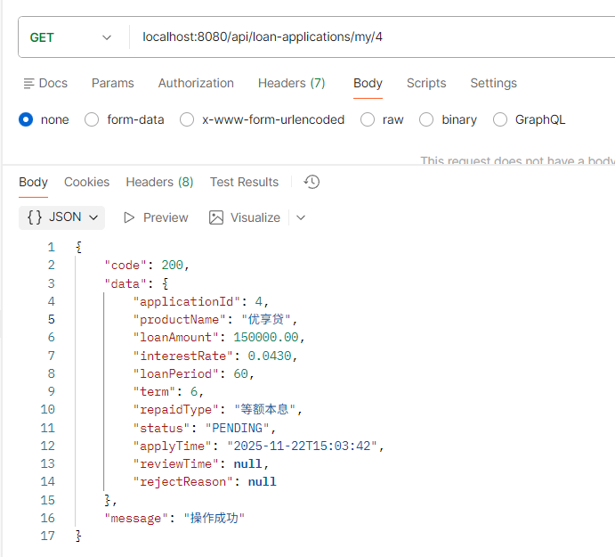

**日志**:

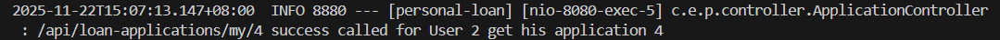

### 查看所有申请

**网址** /api/loan-applications/my

**请求方式** GET

**返回数据**:

``` json
{
    "code": 200,
    "data": [
        {
            "applicationId": 3,
            "productName": "优享贷",
            "loanAmount": 80000,
            "interestRate": 0.041,
            "loanPeriod": 36,
            "term": 6,
            "repaidType": "等额本金",
            "status": "PENDING",
            "applyTime": "2025-11-22T14:36:12",
            "reviewTime": null,
            "rejectReason": null
        },
        {
            "applicationId": 2,
            "productName": "优享贷",
            "loanAmount": 30000,
            "interestRate": 0.039,
            "loanPeriod": 24,
            "term": 6,
            "repaidType": "等额本息",
            "status": "PENDING",
            "applyTime": "2025-11-21T23:24:08",
            "reviewTime": null,
            "rejectReason": null
        }
    ],
    "message": "操作成功"
}
```

**postman测试结果**:

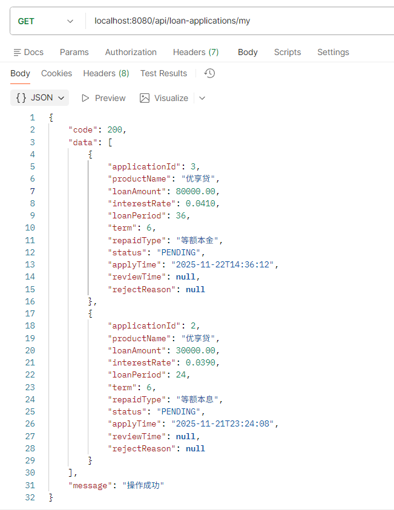

**日志**:

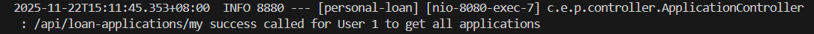

### 撤回/取消申请

**网址** /api/loan-applications/my/{applicationId}/withdraw

**请求方式** POST

**请求参数** :

|字段名|类型|是否必填|说明|示例值|
|---|---|---|---|---|
| applicationId | integer | 是 | 申请id | 3 |

**请求示例（网址）** /api/loan-applications/my/3/withdraw

**返回数据**:

``` json
{
    "code": 200,
    "data": null,
    "message": "操作成功"
}
```

**postman测试结果**:

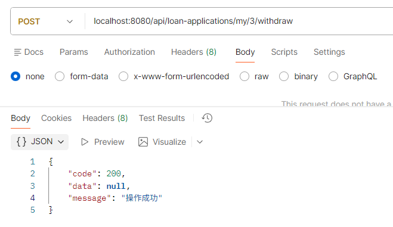

**日志**:

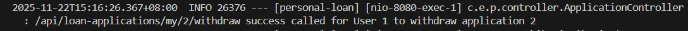

## 管理员使用

### 获取任意用户的单个贷款申请详情

**网址** /api/loan-applications/{applicationId}

**请求方式** GET

**请求参数** :

|字段名|类型|是否必填|说明|示例值|
|---|---|---|---|---|
| applicationId | integer | 是 | 申请id | 4 |

**请求示例（网址）** /api/loan-applications/4

**返回数据**:

``` json
{
    "code": 200,
    "data": {
        "id": 4,
        "userId": 2,
        "productId": 1,
        "userName": "王芳",
        "phoneNumber": "13100001111",
        "productName": "优享贷",
        "loanAmount": 150000,
        "interestRate": 0.043,
        "loanPeriod": 60,
        "term": 6,
        "repaidType": "等额本息",
        "status": "PENDING",
        "applyTime": "2025-11-22T15:03:42",
        "reviewTime": null,
        "rejectReason": null
    },
    "message": "操作成功"
}
```

**postman测试结果**:

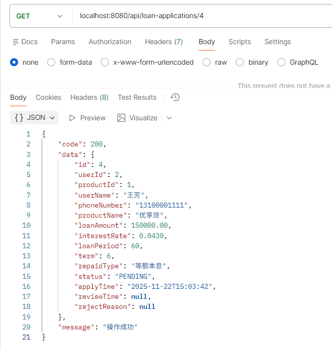

**日志**:

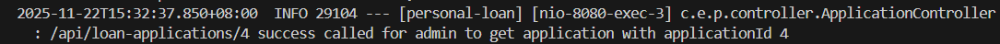

### 获取指定用户的所有贷款申请详情

**网址** /api/loan-applications/user/{userId}

**请求方式** GET

**请求参数** :

|字段名|类型|是否必填|说明|示例值|
|---|---|---|---|---|
| userId | integer | 是 | 用户id | 1 |

**请求示例（网址）** /api/loan-applications/user/1

**返回数据**:

``` json
{
    "code": 200,
    "data": [
        {
            "id": 3,
            "userId": 1,
            "productId": 1,
            "userName": "Tom",
            "phoneNumber": "13712345678",
            "productName": "优享贷",
            "loanAmount": 80000,
            "interestRate": 0.041,
            "loanPeriod": 36,
            "term": 6,
            "repaidType": "等额本金",
            "status": "PENDING",
            "applyTime": "2025-11-22T14:36:12",
            "reviewTime": null,
            "rejectReason": null
        },
        {
            "id": 2,
            "userId": 1,
            "productId": 1,
            "userName": "Tom",
            "phoneNumber": "13712345678",
            "productName": "优享贷",
            "loanAmount": 30000,
            "interestRate": 0.039,
            "loanPeriod": 24,
            "term": 6,
            "repaidType": "等额本息",
            "status": "CANCELLED",
            "applyTime": "2025-11-21T23:24:08",
            "reviewTime": null,
            "rejectReason": null
        }
    ],
    "message": "操作成功"
}
```

**postman测试结果** :

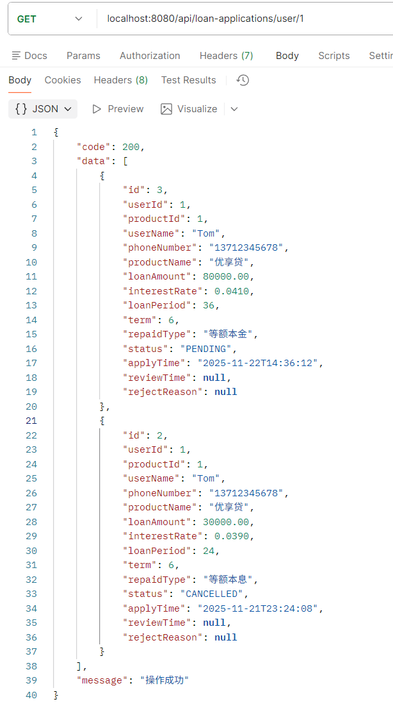

**日志**：

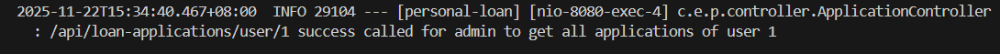
