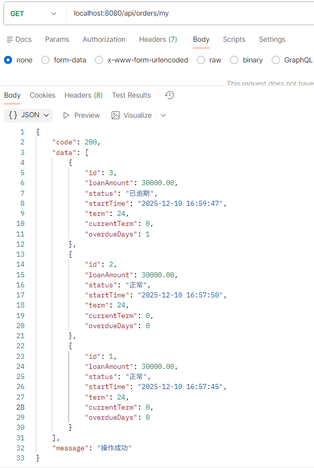
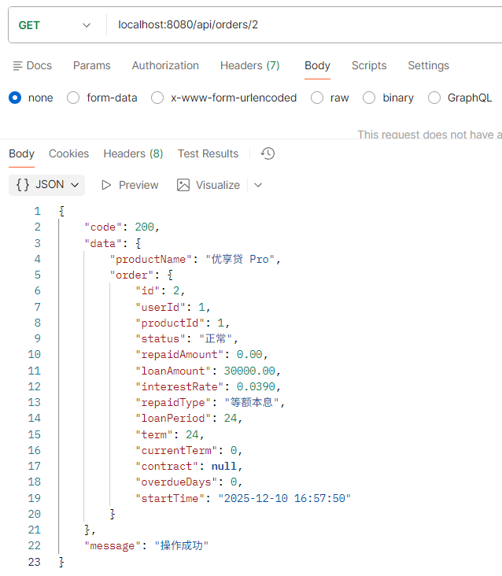
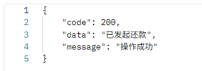
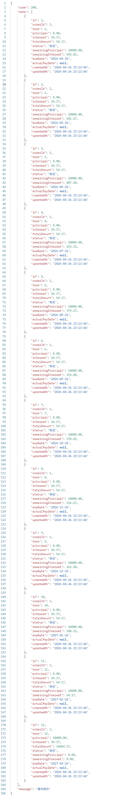
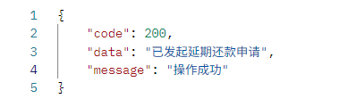
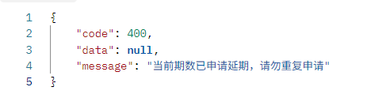
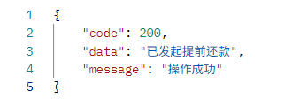

# 贷款订单接口说明

以下接口请求时都需携带请求头，示例：

| 字段 | 值  | 说明 |
| --   | -- | -- |
| Authorization | Bearer token | 需携带有效token |

## 用户获取订单列表

**网址** /api/orders/my

**请求方式** GET

**返回数据**

```json
{
    "code": 200,
    "data": [
        {
            "id": 3,
            "loanAmount": 30000.00,
            "status": "已逾期",
            "startTime": "2025-12-10 16:59:47",
            "term": 24,
            "currentTerm": 0,
            "overdueDays": 1
        },
        {
            "id": 2,
            "loanAmount": 30000.00,
            "status": "正常",
            "startTime": "2025-12-10 16:57:50",
            "term": 24,
            "currentTerm": 0,
            "overdueDays": 0
        },
        {
            "id": 1,
            "loanAmount": 30000.00,
            "status": "正常",
            "startTime": "2025-12-10 16:57:45",
            "term": 24,
            "currentTerm": 0,
            "overdueDays": 0
        }
    ],
    "message": "操作成功"
}
```

**postman测试结果**



## 用户获取订单详情

**网址** /api/orders/{orderId}

**请求方式** GET

**请求示例（网址）** /api/orders/2

**返回数据**

``` json
{
    "code": 200,
    "data": {
        "productName": "优享贷 Pro",
        "order": {
            "id": 2,
            "userId": 1,
            "productId": 1,
            "status": "正常",
            "repaidAmount": 0.00,
            "loanAmount": 30000.00,
            "interestRate": 0.0390,
            "repaidType": "等额本息",
            "loanPeriod": 24,
            "term": 24,
            "currentTerm": 0,
            "contract": null,
            "overdueDays": 0,
            "startTime": "2025-12-10 16:57:50"
        }
    },
    "message": "操作成功"
}
```

**postman测试结果**



## 用户发起还款

**网址** /api/orders/{orderId}/repay

**请求方式** POST

**请求示例（网址）** /api/orders/1/repay

**返回数据**

``` json
{
    "code": 200,
    "data": "已发起还款",
    "message": "操作成功"
}
```

**postman测试结果**



## 用户获取还款计划

**网址** /api/orders/{orderId}/repayment-plan

**请求方式** GET

**请求示例（网址）** /api/orders/2/repayment-plan

**返回数据**  

``` json
{
    "code": 200,
    "data": [
        {
            "id": 1,
            "orderId": 1,
            "term": 1,
            "principal": 0.00,
            "interest": 54.17,
            "totalAmount": 54.17,
            "status": "未还",
            "remainingPrincipal": 10000.00,
            "remainingInterest": 595.83,
            "dueDate": "2026-04-26",
            "actualPayDate": null,
            "createdAt": "2026-04-26 23:13:46",
            "updatedAt": "2026-04-26 23:13:46"
        },
        {
            "id": 2,
            "orderId": 1,
            "term": 2,
            "principal": 0.00,
            "interest": 54.17,
            "totalAmount": 54.17,
            "status": "未还",
            "remainingPrincipal": 10000.00,
            "remainingInterest": 541.67,
            "dueDate": "2026-05-26",
            "actualPayDate": null,
            "createdAt": "2026-04-26 23:13:46",
            "updatedAt": "2026-04-26 23:13:46"
        },
        {
            "id": 3,
            "orderId": 1,
            "term": 3,
            "principal": 0.00,
            "interest": 54.17,
            "totalAmount": 54.17,
            "status": "未还",
            "remainingPrincipal": 10000.00,
            "remainingInterest": 487.50,
            "dueDate": "2026-06-26",
            "actualPayDate": null,
            "createdAt": "2026-04-26 23:13:46",
            "updatedAt": "2026-04-26 23:13:46"
        },
        {
            "id": 4,
            "orderId": 1,
            "term": 4,
            "principal": 0.00,
            "interest": 54.17,
            "totalAmount": 54.17,
            "status": "未还",
            "remainingPrincipal": 10000.00,
            "remainingInterest": 433.33,
            "dueDate": "2026-07-26",
            "actualPayDate": null,
            "createdAt": "2026-04-26 23:13:46",
            "updatedAt": "2026-04-26 23:13:46"
        },
        {
            "id": 5,
            "orderId": 1,
            "term": 5,
            "principal": 0.00,
            "interest": 54.17,
            "totalAmount": 54.17,
            "status": "未还",
            "remainingPrincipal": 10000.00,
            "remainingInterest": 379.17,
            "dueDate": "2026-08-26",
            "actualPayDate": null,
            "createdAt": "2026-04-26 23:13:46",
            "updatedAt": "2026-04-26 23:13:46"
        },
        {
            "id": 6,
            "orderId": 1,
            "term": 6,
            "principal": 0.00,
            "interest": 54.17,
            "totalAmount": 54.17,
            "status": "未还",
            "remainingPrincipal": 10000.00,
            "remainingInterest": 325.00,
            "dueDate": "2026-09-26",
            "actualPayDate": null,
            "createdAt": "2026-04-26 23:13:46",
            "updatedAt": "2026-04-26 23:13:46"
        },
        {
            "id": 7,
            "orderId": 1,
            "term": 7,
            "principal": 0.00,
            "interest": 54.17,
            "totalAmount": 54.17,
            "status": "未还",
            "remainingPrincipal": 10000.00,
            "remainingInterest": 270.83,
            "dueDate": "2026-10-26",
            "actualPayDate": null,
            "createdAt": "2026-04-26 23:13:46",
            "updatedAt": "2026-04-26 23:13:46"
        },
        {
            "id": 8,
            "orderId": 1,
            "term": 8,
            "principal": 0.00,
            "interest": 54.17,
            "totalAmount": 54.17,
            "status": "未还",
            "remainingPrincipal": 10000.00,
            "remainingInterest": 216.67,
            "dueDate": "2026-11-26",
            "actualPayDate": null,
            "createdAt": "2026-04-26 23:13:46",
            "updatedAt": "2026-04-26 23:13:46"
        },
        {
            "id": 9,
            "orderId": 1,
            "term": 9,
            "principal": 0.00,
            "interest": 54.17,
            "totalAmount": 54.17,
            "status": "未还",
            "remainingPrincipal": 10000.00,
            "remainingInterest": 162.50,
            "dueDate": "2026-12-26",
            "actualPayDate": null,
            "createdAt": "2026-04-26 23:13:46",
            "updatedAt": "2026-04-26 23:13:46"
        },
        {
            "id": 10,
            "orderId": 1,
            "term": 10,
            "principal": 0.00,
            "interest": 54.17,
            "totalAmount": 54.17,
            "status": "未还",
            "remainingPrincipal": 10000.00,
            "remainingInterest": 108.33,
            "dueDate": "2027-01-26",
            "actualPayDate": null,
            "createdAt": "2026-04-26 23:13:46",
            "updatedAt": "2026-04-26 23:13:46"
        },
        {
            "id": 11,
            "orderId": 1,
            "term": 11,
            "principal": 0.00,
            "interest": 54.17,
            "totalAmount": 54.17,
            "status": "未还",
            "remainingPrincipal": 10000.00,
            "remainingInterest": 54.17,
            "dueDate": "2027-02-26",
            "actualPayDate": null,
            "createdAt": "2026-04-26 23:13:46",
            "updatedAt": "2026-04-26 23:13:46"
        },
        {
            "id": 12,
            "orderId": 1,
            "term": 12,
            "principal": 10000.00,
            "interest": 54.17,
            "totalAmount": 10054.17,
            "status": "未还",
            "remainingPrincipal": 0.00,
            "remainingInterest": 0.00,
            "dueDate": "2027-03-26",
            "actualPayDate": null,
            "createdAt": "2026-04-26 23:13:46",
            "updatedAt": "2026-04-26 23:13:46"
        }
    ],
    "message": "操作成功"
}
```

**返回数据字段说明**  

| 参数 | 描述 | 类型 |
| ---- | ---- | ---- |
| id | 还款计划ID | Long |
| orderId | 关联的贷款订单ID | Long |
| term | 当前还款期数 | Integer |
| principal | 本期还款本金 | BigDecimal |
| interest | 本期还款利息 | BigDecimal |
| totalAmount | 本期还款总金额 | BigDecimal |
| status | 还款状态（未还/已还/逾期） | String |
| remainingPrincipal | 剩余未还本金 | BigDecimal |
| remainingInterest | 剩余未还利息 | BigDecimal |
| dueDate | 本期应还日期 | LocalDate |
| actualPayDate | 实际还款日期 | LocalDate |
| createdAt | 创建时间 | LocalDateTime |
| updatedAt | 更新时间 | LocalDateTime |

**postman测试结果**  



## 用户申请延期

**网址** /api/orders/{orderId}/postpone

**请求方式** POST

**请求示例（网址）** /api/orders/5/postpone

**返回数据**  

```json
{
    "code": 200,
    "data": "已发起延期还款申请",
    "message": "操作成功"
}
```

**postman测试结果**  




## 用户提前还款

**网址** /api/orders/{orderId}/early-repay

**请求方式** POST

**请求示例（网址）** /api/orders/5/early-repay

**返回数据**  

```json
{
    "code": 200,
    "data": "已发起提前还款",
    "message": "操作成功"
}
```

**postman测试结果**  


