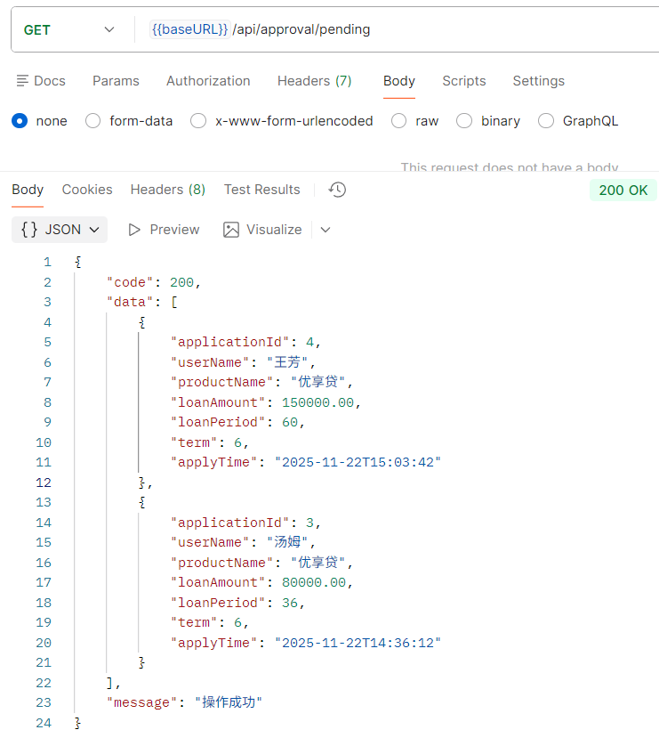
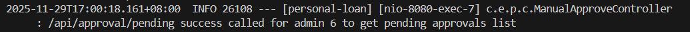
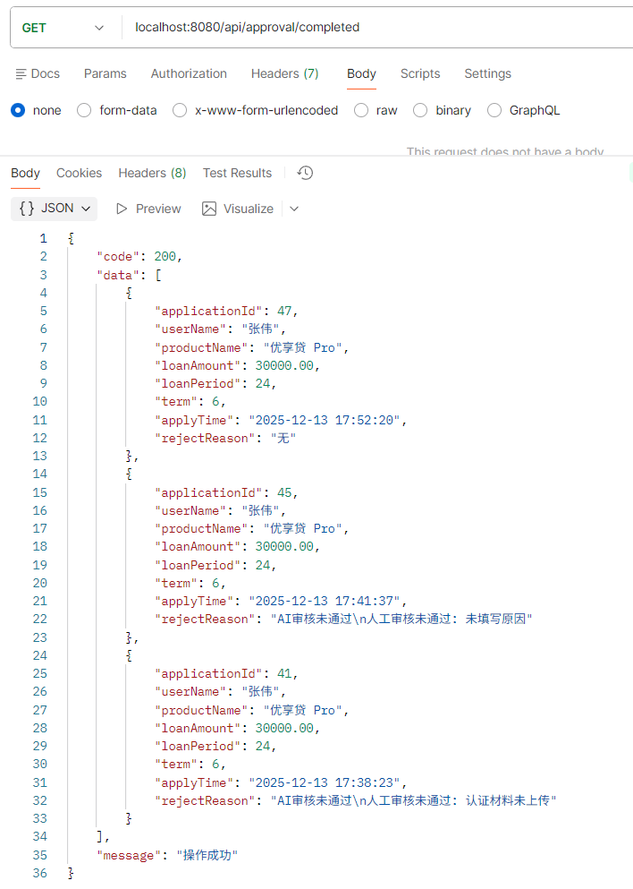
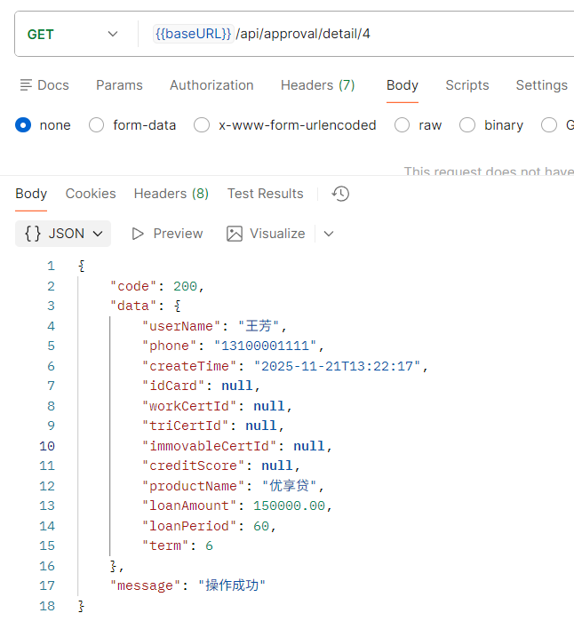
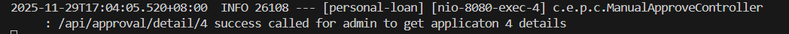
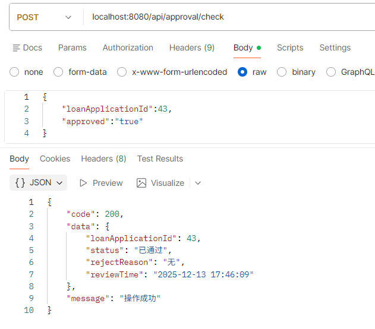
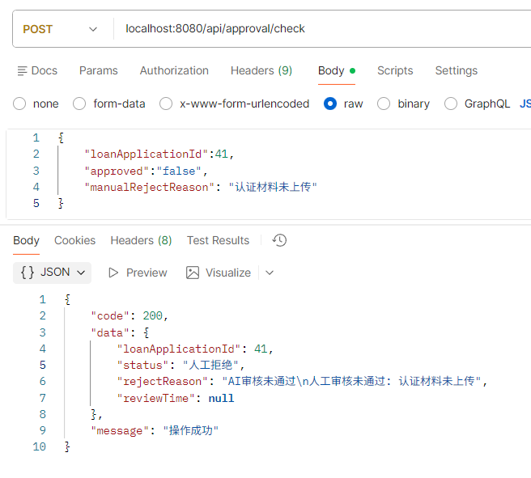
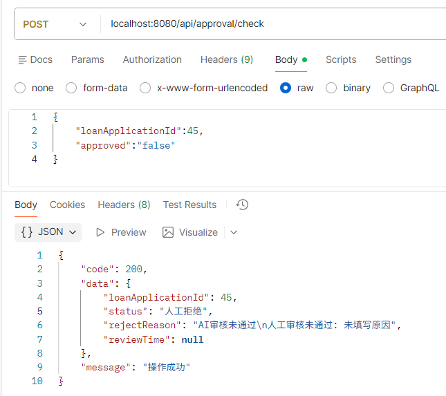
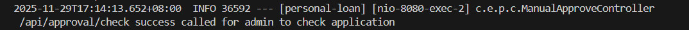

# 人工审核接口说明

以下接口请求时都需携带请求头，示例：

| 字段 | 值  | 说明 |
| --   | -- | -- |
| Authorization | Bearer token | 需携带有效token |

## 查看代办审核列表

**网址** /api/approval/pending

**请求方式** GET

**返回数据**

``` json
{
    "code": 200,
    "data": [
        {
            "applicationId": 5,
            "userName": "alice",
            "productName": "优享贷 Pro",
            "loanAmount": 80000,
            "loanPeriod": 36,
            "term": 12,
            "applyTime": "2025-12-09T20:55:36",
            "rejectReason": "AI rejected\n"
        },
        {
            "applicationId": 4,
            "userName": "alice",
            "productName": "优享贷 Pro",
            "loanAmount": 30000,
            "loanPeriod": 24,
            "term": 12,
            "applyTime": "2025-12-09T20:55:25",
            "rejectReason": "AI rejected\n"
        }
    ],
    "message": "操作成功"
}
```

**postman测试结果**



**日志**



## 查看已办审核列表

**网址** /api/approval/completed

**请求方式** GET

**返回数据**

``` json
{
    "code": 200,
    "data": [
        {
            "applicationId": 47,
            "userName": "张伟",
            "productName": "优享贷 Pro",
            "loanAmount": 30000.00,
            "loanPeriod": 24,
            "term": 6,
            "applyTime": "2025-12-13 17:52:20",
            "rejectReason": "无"
        },
        {
            "applicationId": 45,
            "userName": "张伟",
            "productName": "优享贷 Pro",
            "loanAmount": 30000.00,
            "loanPeriod": 24,
            "term": 6,
            "applyTime": "2025-12-13 17:41:37",
            "rejectReason": "AI审核未通过\n人工审核未通过: 未填写原因"
        },
        {
            "applicationId": 41,
            "userName": "张伟",
            "productName": "优享贷 Pro",
            "loanAmount": 30000.00,
            "loanPeriod": 24,
            "term": 6,
            "applyTime": "2025-12-13 17:38:23",
            "rejectReason": "AI审核未通过\n人工审核未通过: 认证材料未上传"
        }
    ],
    "message": "操作成功"
}
```

**postman测试结果**



## 查看单个审核申请详情(代办和已办都用这个接口)

**网址** /api/approval/detail/{loanApplicationId}

**请求方式** GET

**请求参数**

|字段名|类型|是否必填|说明|示例值|
|---|---|---|---|---|
| loanApplicationId | integer | 是 | 申请id | 23 |

**请求示例（网址）** /api/approval/detail/23

**返回数据**

``` json
{
    "code": 200,
    "data": {
        "user": {
            "id": 1,
            "userName": "alice",
            "avatar": null,
            "phone": "13800138000",
            "password": "$2a$10$otTD6KpzXlbblLqzZmqNIOR4vwNcSLKUAt0Um3rh85KPWM89Xvpr2",
            "role": 0,
            "createTime": "2025-12-08T09:20:20",
            "updateTime": "2025-12-08T13:42:03"
        },
        "userCert": {
            "userId": 1,
            "idCard": null,
            "creditScore": null,
            "bankCardId": null,
            "workCertId": null,
            "triCertId": null,
            "immovableCertId": null
        },
        "application": {
            "id": 23,
            "userId": 1,
            "productId": 1,
            "status": "AI_REJECTED",
            "loanAmount": 30000.00,
            "interestRate": 0.0390,
            "loanPeriod": 24,
            "term": 6,
            "repaidType": "等额本息",
            "rejectReason": "AI rejected\n",
            "applyTime": "2025-12-10T14:59:49",
            "reviewTime": null
        }
    },
    "message": "操作成功"
}
```

**postman测试结果**



**日志**



## 返回审核结果

**网址** /api/approval/check

**请求方式** POST

**请求参数**

|字段名|类型|是否必填|说明|示例值|
|---|---|---|---|---|
| loanApplicationId | integer | 是 | 申请id | 43 |
| approved | string | 是 | true表示通过，false表示不通过 | true |
| manualRejectReason | String | 否 | 拒绝时需要填写原因 | 认证材料未上传 |

**请求示例（请求体）（通过）**

``` json
{
    "loanApplicationId":43,
    "approved":"true"
}
```

**返回数据（通过）**

``` json
{
    "code": 200,
    "data": {
        "loanApplicationId": 43,
        "status": "已通过",
        "rejectReason": "无",
        "reviewTime": "2025-12-13 17:46:09"
    },
    "message": "操作成功"
}
```

**请求示例（请求体）（拒绝）**

``` json
{
    "loanApplicationId":41,
    "approved":"false",
    "manualRejectReason": "认证材料未上传"
}
```

**返回数据（拒绝）**

``` json
{
    "code": 200,
    "data": {
        "loanApplicationId": 41,
        "status": "人工拒绝",
        "rejectReason": "AI审核未通过\n人工审核未通过: 认证材料未上传",
        "reviewTime": null
    },
    "message": "操作成功"
}
```

**postman测试结果**





**日志**

