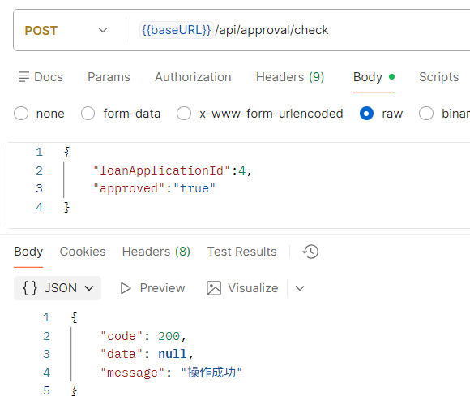

# 人工审核接口说明

以下接口请求时都需携带请求头，示例：

| 字段 | 值  | 说明 |
| --   | -- | -- |
| Authorization | Bearer token | 需携带有效token |

## 查看代办审核列表

**网址** /api/approval/pending

**请求方式** GET

**返回数据**

``` json
{
  "code": 200,
  "data": [
    {
      "applicationId": 4,
      "userName": "王芳",
      "productName": "优享贷",
      "loanAmount": 150000.00,
      "loanPeriod": 60,
      "term": 6,
      "applyTime": "2025-11-22T15:03:42"
    },
    {
      "applicationId": 3,
      "userName": "汤姆",
      "productName": "优享贷",
      "loanAmount": 80000.00,
      "loanPeriod": 36,
      "term": 6,
      "applyTime": "2025-11-22T14:36:12"
    }
  ],
  "message": "操作成功"
}
```

**postman测试结果**


**日志**


## 查看单个代办审核申请详情

**网址** /api/approval/detail/{loanApplicationId}

**请求方式** GET

**请求参数**

|字段名|类型|是否必填|说明|示例值|
|---|---|---|---|---|
| loanApplicationId | integer | 是 | 申请id | 4 |

**请求示例（网址）** /api/approval/detail/4

**返回数据**

``` json
{
  "code": 200,
  "data": {
    "userName": "王芳",
    "phone": "13100001111",
    "createTime": "2025-11-21T13:22:17",
    "idCard": null,
    "workCertId": null,
    "triCertId": null,
    "immovableCertId": null,
    "creditsScore": null,
    "productName": "优享贷",
    "loanAmount": 150000.00,
    "loanPeriod": 60,
    "term": 6
  },
  "message": "操作成功"
}
```

**postman测试结果**


**日志**


## 返回审核结果

**网址** /api/approval/check

**请求方式** POST

**请求参数**

|字段名|类型|是否必填|说明|示例值|
|---|---|---|---|---|
| loanApplicationId | integer | 是 | 申请id | 4 |
| approved | string | 是 | true表示通过，false表示不通过 | true |

**请求示例（请求体）**

``` json
{
    "loanApplicationId":4,
    "approved":"true"
}
```

**返回数据**

``` json
{
    "code": 200,
    "data": null,
    "message": "操作成功"
}
```

**postman测试结果**



**日志**

