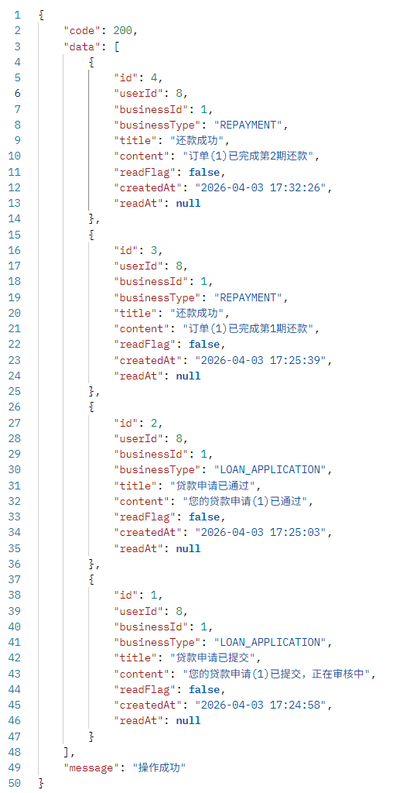
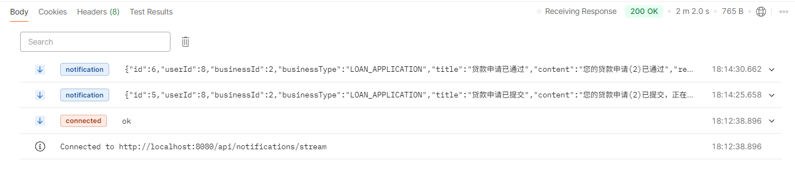
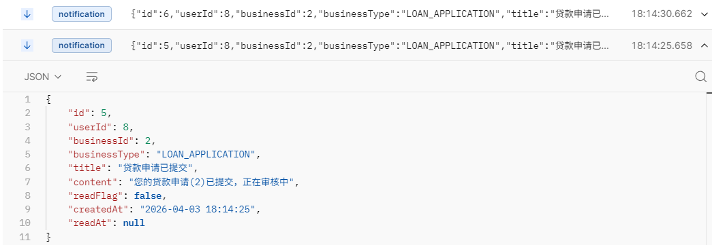
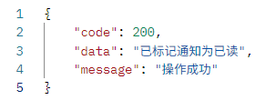
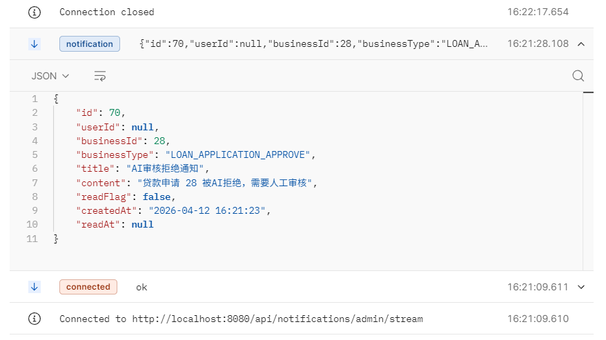
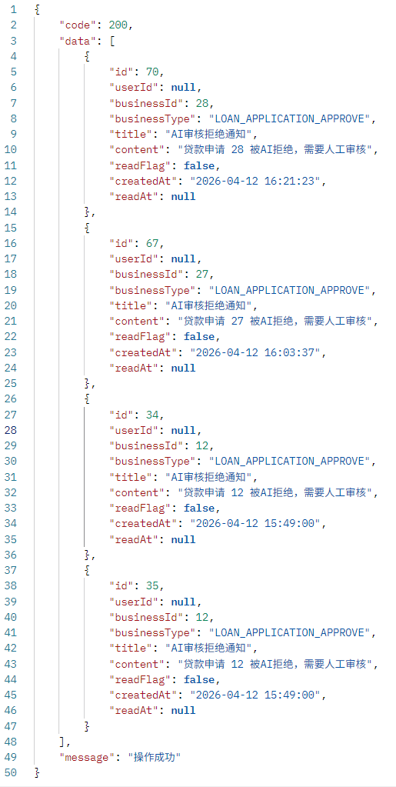

# 消息通知接口

## 用户获取所有消息

**网址** /api/notifications/my

**请求方式** GET

**返回数据**  

``` json
{
    "code": 200,
    "data": [
        {
            "id": 4,
            "userId": 8,
            "businessId": 1,
            "businessType": "REPAYMENT",
            "title": "还款成功",
            "content": "订单(1)已完成第2期还款",
            "readFlag": false,
            "createdAt": "2026-04-03 17:32:26",
            "readAt": null
        },
        {
            "id": 3,
            "userId": 8,
            "businessId": 1,
            "businessType": "REPAYMENT",
            "title": "还款成功",
            "content": "订单(1)已完成第1期还款",
            "readFlag": false,
            "createdAt": "2026-04-03 17:25:39",
            "readAt": null
        }
    ],
    "message": "操作成功"
}
```

**返回数据字段说明**  

| 参数 | 描述 | 类型 |
| ---- | ---- | ---- |
| id | 通知ID | Long |
| userId | 用户ID | Long |
| businessId | 业务ID，贷款申请ID（applicationId）；还款订单ID（orderId） | Long |
| businessType | 业务类型，LOAN_APPLICATION_STATUS，表示贷款申请状态变更通知；REPAYMENT，表示还款通知 | String |
| title | 标题 | String |
| content | 内容 | String |
| readFlag | 是否已读 | Boolean |
| createdAt | 创建时间 | String |
| readAt | 读取时间 | String |

**postman测试结果**  



## 用户订阅实时通知流

**网址** /api/notifications/stream

**请求方式** GET

**响应数据格式** SSE 需要监听 message 事件

Content-Type: text/event-stream  
数据格式: JSON 字符串

**示例推送数据**：

``` json
{
    "id": 5,
    "userId": 8,
    "businessId": 2,
    "businessType": "LOAN_APPLICATION",
    "title": "贷款申请已提交",
    "content": "您的贷款申请(2)已提交，正在审核中",
    "readFlag": false,
    "createdAt": "2026-04-03 18:14:25",
    "readAt": null
}
```

**postman测试结果**  

  



## 用户管理员 标记通知已读

**网址** /api/notifications/{notificationId}/read

**请求方式** PATCH

**参数**  

| 参数 | 描述 | 类型 | 是否必填 |
| ---- | ---- | ---- | ---- |
| notificationId | 通知ID | Long | 是 |

**请求示例（网址）** /api/notifications/4/read

**返回数据**  

``` json
{
    "code": 200,
    "data": "已标记通知为已读",
    "message": "操作成功"
}
```

**postman测试结果**  



## 管理员订阅实时通知流

**网址** /api/notifications/admin/stream

**请求方式** GET

**响应数据格式** SSE 需要监听 message 事件

Content-Type: text/event-stream  
数据格式: JSON 字符串

**示例推送数据**：

``` json
{
    "id": 70,
    "userId": null,
    "businessId": 28,
    "businessType": "LOAN_APPLICATION_APPROVE",
    "title": "AI审核拒绝通知",
    "content": "贷款申请 28 被AI拒绝，需要人工审核",
    "readFlag": false,
    "createdAt": "2026-04-12 16:21:23",
    "readAt": null
}
```

**postman测试结果**  



## 管理员获取所有通知

**网址** /api/notifications/admin

**请求方式** GET

**返回数据**  

``` json
{
    "code": 200,
    "data": [
        {
            "id": 70,
            "userId": null,
            "businessId": 28,
            "businessType": "LOAN_APPLICATION_APPROVE",
            "title": "AI审核拒绝通知",
            "content": "贷款申请 28 被AI拒绝，需要人工审核",
            "readFlag": false,
            "createdAt": "2026-04-12 16:21:23",
            "readAt": null
        },
        {
            "id": 67,
            "userId": null,
            "businessId": 27,
            "businessType": "LOAN_APPLICATION_APPROVE",
            "title": "AI审核拒绝通知",
            "content": "贷款申请 27 被AI拒绝，需要人工审核",
            "readFlag": false,
            "createdAt": "2026-04-12 16:03:37",
            "readAt": null
        }
    ],
    "message": "操作成功"
}
```

**返回数据字段说明**  

| 参数 | 描述 | 类型 |
| ---- | ---- | ---- |
| id | 通知ID | Long |
| userId | 用户ID，管理员为null | Long |
| businessId | 业务ID，此处为贷款申请ID（applicationId） | Long |
| businessType | 业务类型，此处为LOAN_APPLICATION_APPROVE，表示贷款申请审核通知 | String |
| title | 标题 | String |
| content | 内容 | String |
| readFlag | 是否已读 | Boolean |
| createdAt | 创建时间 | String |
| readAt | 读取时间 | String |

**postman测试结果**  



## 用户管理员 删除通知

**网址** /api/notifications/{notificationId}

**请求方式** DELETE

**参数**  

| 参数 | 描述 | 类型 | 是否必填 |
| ---- | ---- | ---- | ---- |
| notificationId | 通知ID | Long | 是 |

**请求示例（网址）** /api/notifications/70

**返回数据**  

``` json
{
    "code": 200,
    "data": "删除成功",
    "message": "操作成功"
}
```

## 用户管理员 批量删除通知

**网址** /api/notifications/batch

**请求方式** DELETE

**参数**  

| 参数 | 描述 | 类型 | 是否必填 |
| ---- | ---- | ---- | ---- |
| notificationIds | 通知ID列表 | List<Long> | 是 |

**请求示例（请求体）**

``` json
[67,70,73]
```

**返回数据**  

``` json
{
    "code": 200,
    "data": "批量删除成功",
    "message": "操作成功"
}
```
