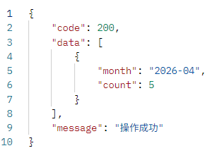
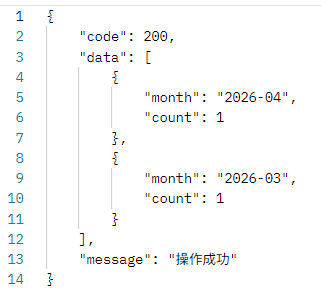
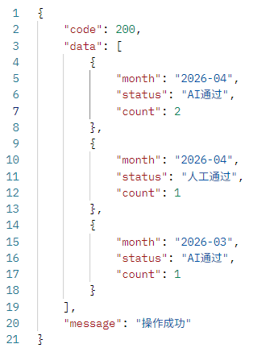

# 获取统计数据接口

## 每月申请量统计

**网址** /api/statistics/monthly-applications

**请求方式** GET

**返回数据**  

```json
{
    "code": 200,
    "data": [
        {
            "month": "2026-04",
            "count": 4
        },
        {
            "month": "2026-03",
            "count": 1
        }
    ],
    "message": "操作成功"
}
```

**返回数据说明**  

|参数|描述|类型|
|---|---|---|
|month|月份（yyyy-mm）|String|
|count|贷款申请数量|Integer|

**postman测试结果**  



## 每月通过量统计

**网址** /api/statistics/monthly-approvals

**请求方式** GET

**返回数据**  

```json
{
    "code": 200,
    "data": [
        {
            "month": "2026-04",
            "count": 1
        },
        {
            "month": "2026-03",
            "count": 1
        }
    ],
    "message": "操作成功"
}
```

**返回数据说明**  

|参数|描述|类型|
|---|---|---|
|month|月份（yyyy-mm）|String|
|count|贷款通过数量|Integer|

**postman测试结果**  



## 每月AI通过和人工通过的数量统计

**网址** /api/statistics/approval-types

**请求方式** GET

**返回数据**  

```json
{
    "code": 200,
    "data": [
        {
            "month": "2026-04",
            "status": "AI通过",
            "count": 2
        },
        {
            "month": "2026-04",
            "status": "人工通过",
            "count": 1
        },
        {
            "month": "2026-03",
            "status": "AI通过",
            "count": 1
        }
    ],
    "message": "操作成功"
}
```

**返回数据说明**  

|参数|描述|类型|
|---|---|---|
|month|月份（yyyy-mm）|String|
|status|状态（AI通过/人工通过）|String|
|count|数量|Integer|

**postman测试结果**  


