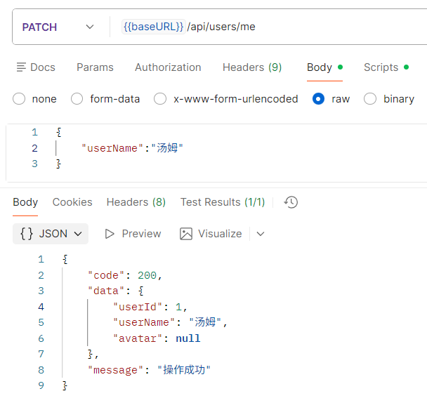
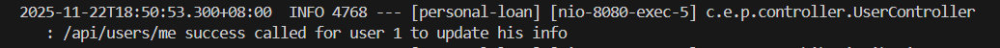
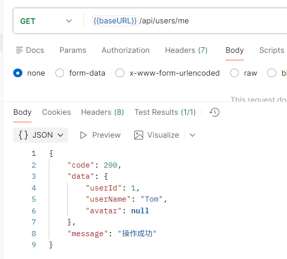
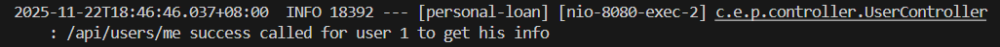
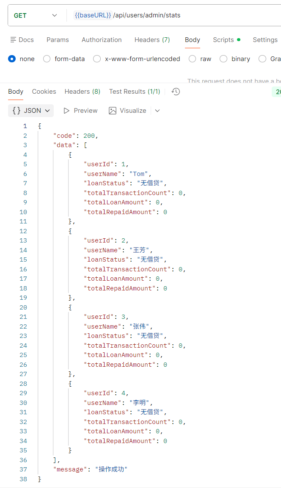
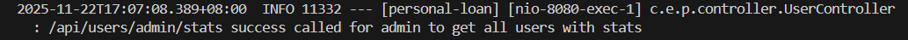
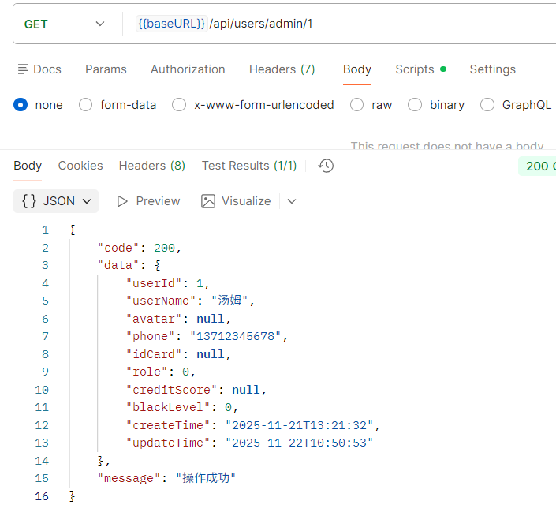
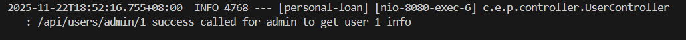

# 用户接口说明

以下接口请求时都需携带请求头，实例：

| 字段 | 值  | 说明 |
| --   | -- | -- |
| Authorization | Bearer token | 需携带有效token |

## 用户使用

### 用户修改信息

**网址** /api/users/me

**请求方式** PATCH

**请求参数（可选）**:

|字段名|类型|是否必填|说明|示例值|
|---|---|---|---|---|
| userName | integer | 否 | 新的用户名 | 汤姆 |
| avatar | string | 否 | 新的头像 | 无,表示不更改头像 |

**请求示例（请求体）**:

``` json
{
    "userName":"汤姆"
}
```

**返回数据**:

``` json
{
    "code": 200,
    "data": {
        "userId": 1,
        "userName": "汤姆",
        "avatar": null
    },
    "message": "操作成功"
}
```

**postman测试结果**:



**日志**:



### 查询信息

**网址** /api/users/me

**请求方式** GET

**返回数据**:

``` json
{
    "code": 200,
    "data": {
        "userId": 1,
        "userName": "Tom",
        "avatar": null
    },
    "message": "操作成功"
}
```

**postman测试结果**:



**日志**:



## 管理员使用

### 查询用户状态列表

**网址** /api/users/admin/stats

**请求方式** GET

**返回数据**:

``` json
{
    "code": 200,
    "data": [
        {
            "userId": 1,
            "userName": "Tom",
            "loanStatus": "无借贷",
            "totalTransactionCount": 0,
            "totalLoanAmount": 0,
            "totalRepaidAmount": 0
        },
        {
            "userId": 2,
            "userName": "王芳",
            "loanStatus": "无借贷",
            "totalTransactionCount": 0,
            "totalLoanAmount": 0,
            "totalRepaidAmount": 0
        },
        {
            "userId": 3,
            "userName": "张伟",
            "loanStatus": "无借贷",
            "totalTransactionCount": 0,
            "totalLoanAmount": 0,
            "totalRepaidAmount": 0
        },
        {
            "userId": 4,
            "userName": "李明",
            "loanStatus": "无借贷",
            "totalTransactionCount": 0,
            "totalLoanAmount": 0,
            "totalRepaidAmount": 0
        }
    ],
    "message": "操作成功"
}
```

**postman测试结果**:



**日志**:



### 查看单个用户详细信息

**网址** /api/users/admin/{userId}

**请求方式** GET

**请求参数**:

|字段名|类型|是否必填|说明|示例值|
|---|---|---|---|---|
| userId | integer | 是 | 用户id | 1 |

**请求示例(网址)** /api/users/admin/1

**返回数据**:

``` json
{
    "code": 200,
    "data": {
        "userId": 1,
        "userName": "汤姆",
        "avatar": null,
        "phone": "13712345678",
        "idCard": null,
        "role": 0,
        "creditScore": null,
        "blackLevel": 0,
        "createTime": "2025-11-21T13:21:32",
        "updateTime": "2025-11-22T10:50:53"
    },
    "message": "操作成功"
}
```

**postman测试结果**:



**日志**:



### 根据信誉分从高到低查询用户

**网址** /api/users/search-by-credit

**请求方式** GET

**请求参数**:

|字段名|类型|是否必填|说明|示例值|
|---|---|---|---|---|
| expr |  String  |  是  | 信仰分筛选表达式，支持>,<,>=,<=,=  |  <100  |

**请求实例（网址）** /api/users/search-by-credit?expr=<100

**返回数据**:

``` json
[
  {
    "id": 5,
    "name": "李华",
    "phone": "13912345678",
    "creditScore": 70,
    "createTime": "2025-11-11T16:08:50"
  },
  {
    "id": 4,
    "name": "Alice_Wang",
    "phone": "15912345678",
    "creditScore": 65,
    "createTime": "2025-11-11T16:02:20"
  },
  {
    "id": 3,
    "name": "张三",
    "phone": "13800138000",
    "creditScore": 60,
    "createTime": "2025-11-11T15:59:10"
  }
]
```

**postman测试**:


