# 贷款产品接口说明

以下接口请求时都需携带请求头，示例：

| 字段 | 值  | 说明 |
| --   | -- | -- |
| Authorization | Bearer token | 需携带有效token |

## 用户功能

### 查看所有贷款产品

**网址** /api/loan-products/user

**请求方式** GET

**返回数据**：

``` json
{
    "code": 200,
    "data": [
        {
            "productId": 1,
            "productName": "优享贷",
            "description": "专为信用良好用户定制，利率优惠，期限灵活",
            "loanUsage": "教育、购车、旅游、大额消费",
            "promotionDetails": "首年利率85折",
            "terms": [
                6,
                12,
                18,
                24,
                30,
                36,
                42,
                48,
                54,
                60
            ],
            "options": [
                {
                    "optionId": 1,
                    "loanAmount": 30000.00,
                    "interestRate": 0.0390,
                    "loanPeriod": 24,
                    "repaidType": "等额本息"
                },
                {
                    "optionId": 2,
                    "loanAmount": 80000.00,
                    "interestRate": 0.0410,
                    "loanPeriod": 36,
                    "repaidType": "等额本金"
                },
                {
                    "optionId": 3,
                    "loanAmount": 150000.00,
                    "interestRate": 0.0430,
                    "loanPeriod": 60,
                    "repaidType": "等额本息"
                }
            ]
        },
        {
            "productId": 2,
            "productName": "极速贷",
            "description": "专为信用良好用户定制，利率优惠，期限灵活",
            "loanUsage": "教育、购车、旅游、大额消费",
            "promotionDetails": "首年利率85折",
            "terms": [
                6,
                12,
                18,
                24,
                30,
                36
            ],
            "options": [
                {
                    "optionId": 4,
                    "loanAmount": 30000.00,
                    "interestRate": 0.0390,
                    "loanPeriod": 24,
                    "repaidType": "等额本息"
                },
                {
                    "optionId": 5,
                    "loanAmount": 80000.00,
                    "interestRate": 0.0410,
                    "loanPeriod": 36,
                    "repaidType": "等额本金"
                },
                {
                    "optionId": 6,
                    "loanAmount": 150000.00,
                    "interestRate": 0.0430,
                    "loanPeriod": 60,
                    "repaidType": "等额本息"
                }
            ]
        }
    ],
    "message": "操作成功"
}
```

**postman测试**：

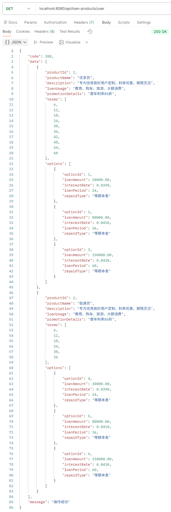

**日志**：

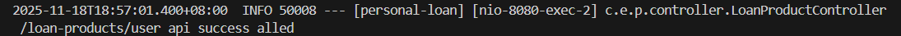

### 根据名称搜索贷款产品

**网址** /api/loan-products/user/search

**请求方式** GET

**请求参数**:

|字段名|类型|是否必填|说明|示例值|
|---|---|---|---|---|
|name|string|是|贷款产品名称|优享贷|

**请求示例（网址）** /api/loan-products/user/search?name=优享贷

**返回数据**：

``` json
{
    "code": 200,
    "data": [
        {
            "productId": 1,
            "productName": "优享贷",
            "description": "专为信用良好用户定制，利率优惠，期限灵活",
            "loanUsage": "教育、购车、旅游、大额消费",
            "promotionDetails": "首年利率85折",
            "terms": [
                6,
                12,
                18,
                24,
                30,
                36,
                42,
                48,
                54,
                60
            ],
            "options": [
                {
                    "optionId": 1,
                    "loanAmount": 30000.00,
                    "interestRate": 0.0390,
                    "loanPeriod": 24,
                    "repaidType": "等额本息"
                },
                {
                    "optionId": 2,
                    "loanAmount": 80000.00,
                    "interestRate": 0.0410,
                    "loanPeriod": 36,
                    "repaidType": "等额本金"
                },
                {
                    "optionId": 3,
                    "loanAmount": 150000.00,
                    "interestRate": 0.0430,
                    "loanPeriod": 60,
                    "repaidType": "等额本息"
                }
            ]
        }
    ],
    "message": "操作成功"
}
```

**postman测试结果**：

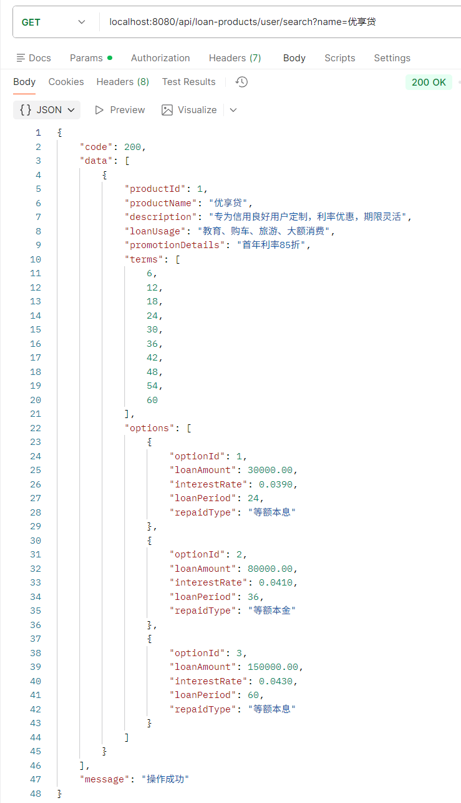

**日志**:

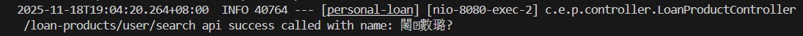

## 管理员功能

### 增加贷款产品

**网址** /api/loan-products/admin

**请求方式**：POST

**请求参数**:

|字段名|类型|是否必填|说明|示例值|
|---|---|---|---|---|
|  productName  |  string  |是|  贷款产品名称     |极速贷|
|  description  |  string  |是|  产品描述         |  审批快，放贷快|
|  loanUsage    |  string  |是|  产品用途         |   消费、装修、教育|
|  minTerm      |  integer  |是|   最短借款期限（单位：月）  | 3|
|  maxTerm      |  integer  |是|  最长借款期限（单位：月）  | 24 |
|  termStep     |  integer  |是|   期限递增步长（单位：月）  | 3 |
|  promotionDetails |  string |否|   促销描述，用于展示给用户  |无|
|  options      |  array   |是|    可选方案列表，每个选项代表一种方案组合  |见下表|

**options集合中的参数说明：**

|字段名|类型|是否必填|说明|示例值|
|---|---|---|---|---|
|  loanAmount | number | 是 | 贷款额度（单位：元）,最多12位数字，其中小数部分2位 | 10000.00 |
|  loanPeriod | integer | 是 | 贷款期限（单位：月） | 12 |
| interestRate | number | 是 | 年化利率,最多6位数字，其中小数部分4位 | 0.049 |
|  repaidType | string | 是 | 还款方式，目前支持："等额本金"、"等额本息" 、"一次性还本付息" | "等额本息" |

**请求示例（请求体）：**

``` json
{
  "productName": "极速贷",
  "description": "审批快，放款快",
  "loanUsage": "消费、装修、教育",
  "minTerm": 3,
  "maxTerm": 24,
  "termStep": 3,
  "promotionDetails": "无",
  "options": [
    {
      "loanAmount": 10000.00,
      "interestRate": 0.049,
      "loanPeriod": 12,
      "repaidType": "等额本息"
    }
  ]
}
```

**返回数据：**

``` json
{
    "code": 200,
    "data": {
        "id": 2,
        "productName": "极速贷",
        "description": "审批快，放款快",
        "loanUsage": "消费、装修、教育",
        "minTerm": 3,
        "maxTerm": 24,
        "termStep": 3,
        "promotionDetails": "无",
        "options": [
            {
                "id": 2,
                "productId": 2,
                "loanPeriod": 12,
                "loanAmount": 10000,
                "interestRate": 0.049,
                "repaidType": "等额本息",
                "createTime": "2025-11-18T17:10:45.9331697",
                "updateTime": "2025-11-18T17:10:45.9331697"
            }
        ],
        "createTime": "2025-11-18T17:10:45.8932953",
        "updateTime": "2025-11-18T17:10:45.8932953"
    },
    "message": "贷款产品创建成功"
}
```

**postman测试结果**：

**成功**
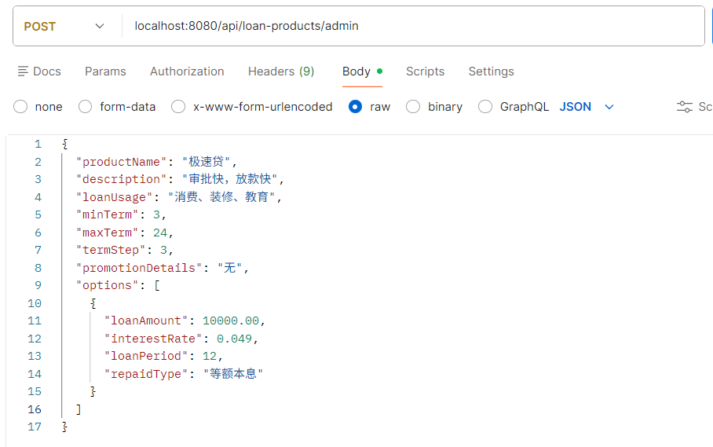
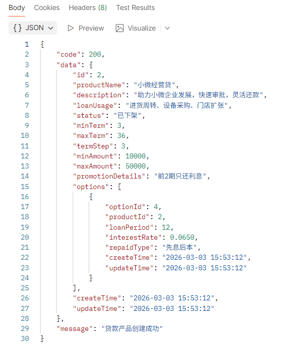

**失败**
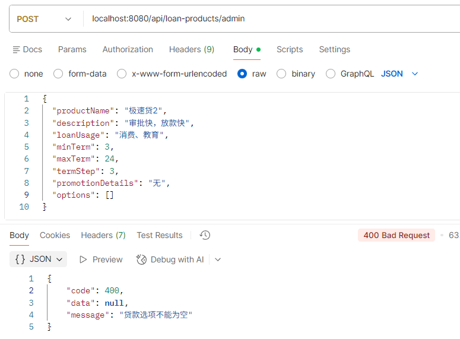
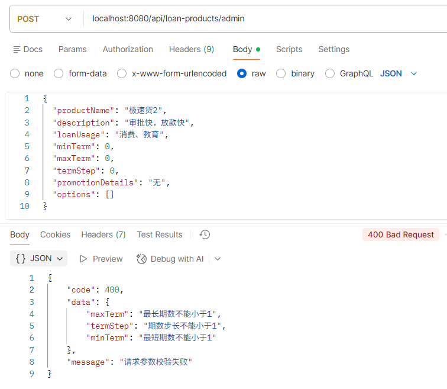

**日志**：

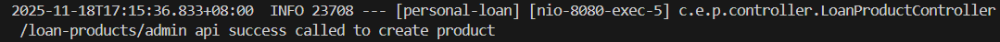

### 为指定产品批量增加选项

**网址** /api/loan-products/admin/options/batch-create

**请求方式** POST

**请求参数**:

|字段名|类型|是否必填|说明|示例值|
|---|---|---|---|---|
|productId|integer|是|要添加方案的目标产品 ID，必须是已存在的产品|2|
|options|array|是|要创建的贷款方案列表|见下表|

**options 集合中参数说明**:

|字段名|类型|是否必填|说明|示例值|
|---|---|---|---|---|
| loanAmount | number | 是 | 贷款额度（单位：元），最多12位数字，其中小数部分2位 | 20000.00, 50000.00 |
| loanPeriod | integer | 是 | 贷款期限（单位：月）  | 18，24 |
| interestRate | number | 是 | 年化利率，最多6位数字，其中小数部分4位 | 0.055, 0.06 |
| repaidType | string | 是 | 还款方式 | "等额本金","先息后本" |

**请求示例（请求体）**:

``` json
{
  "productId": 2,
  "options": [
    {
      "loanAmount": 20000.00,
      "interestRate": 0.055,
      "loanPeriod": 18,
      "repaidType": "等额本金"
    },
    {
      "loanAmount": 50000.00,
      "interestRate": 0.06,
      "loanPeriod": 24,
      "repaidType": "先息后本"
    }
  ]
}
```

**返回数据**:

``` json
{
    "code": 200,
    "data": "Batch create loan options success",
    "message": "操作成功"
}
```

**postman测试结果**

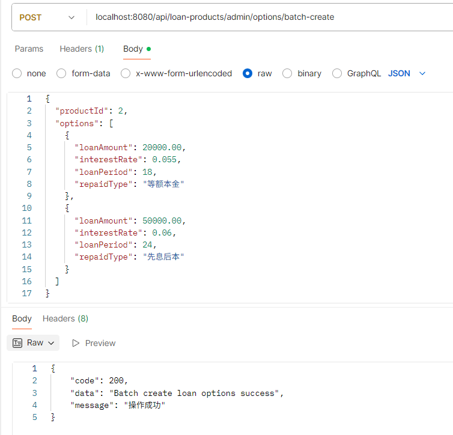

**日志**

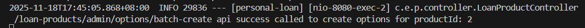

### 上架产品

**网址** /api/loan-products/admin/{productId}/active

**请求方式** POST

**请求参数**

|字段名|类型|是否必填|说明|示例值|
|---|---|---|---|---|
| productId | integer | 是 | 产品id | 1 |

**请求示例（网址）** /api/loan-products/admin/1/active

**返回数据**

``` json
{
    "code": 200,
    "data": null,
    "message": "产品上架成功"
}
```

**postman测试结果**

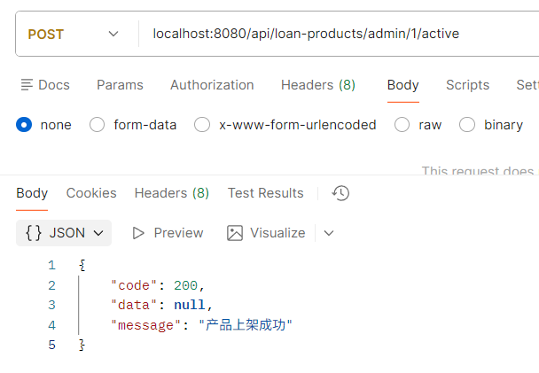

**日志**

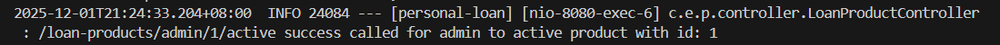

### 下架产品

**网址** /api/loan-products/admin/{productId}/deactive

**请求方式** POST

**请求参数**

|字段名|类型|是否必填|说明|示例值|
|---|---|---|---|---|
| productId | integer | 是 | 产品id | 1 |

**请求示例（网址）**/api/loan-products/admin/1/deactive

**返回数据**

``` json
{
    "code": 200,
    "data": null,
    "message": "产品下架成功"
}
```

**postman测试结果**

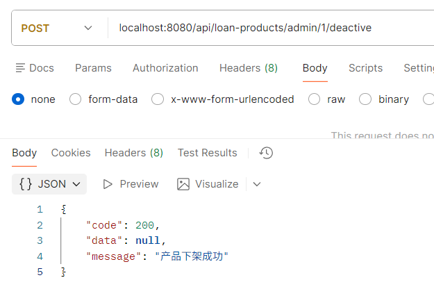

**日志**

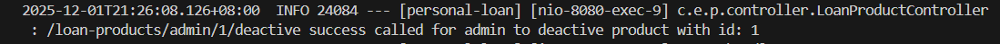

### 删除单个产品

**网址** /api/loan-products/admin/products/{productId}

**请求方式**：DELETE

**请求参数**：

|字段名|类型|是否必填|说明|示例值|
|---|---|---|---|---|
|productId|Long|是|产品Id|9|

**请求示例（网址）** /api/loan-products/admin/products/9

**返回数据(返回字符串)**：

``` json
{
    "code": 200,
    "data": "Loan product delete success",
    "message": "操作成功"
}
```

**postman测试结果**:

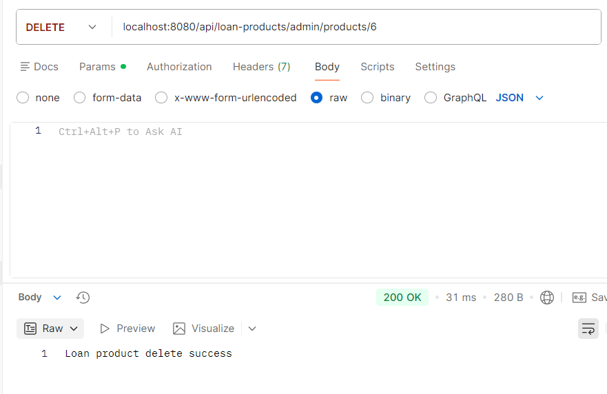

**日志**：

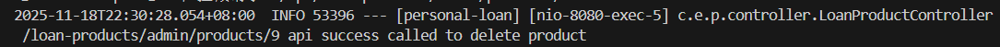

### 删除产品的单个选项

**网址** /api/loan-products/admin/options/{optionId}

**请求方式** DELETE

**请求参数**:

|字段名|类型|是否必填|说明|示例值|
|---|---|---|---|---|
|optionId|Long|是|指定产品的选项Id|4|

**请求示例（网址）**：/api/loan-products/admin/options/4

**返回数据**:

``` json
{
    "code": 200,
    "data": "The option of product delete success",
    "message": "操作成功"
}
```

**postman测试结果：**

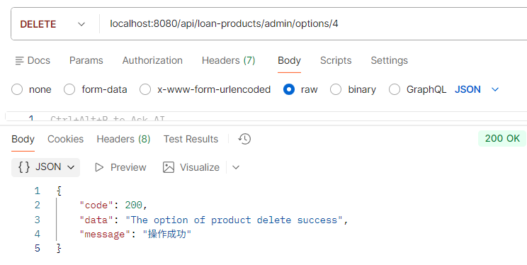

**日志**：

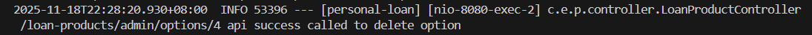

### 批量删除产品的选项

**网址** /api/loan-products/admin/options/batch-delete

**请求方式** POST

**请求参数**：

|字段名|类型|是否必填|说明|示例值|
|---|---|---|---|---|
| ids | array | 是 | 要删除的贷款方案 ID 列表 | [3, 6] |

**请求示例（请求体）：**

``` json
{
  "ids": [3, 6]
}
```

**返回数据**：

``` json
{
    "code": 200,
    "data": "Batch delete specific loan options success",
    "message": "操作成功"
}
```

**postman测试结果**:

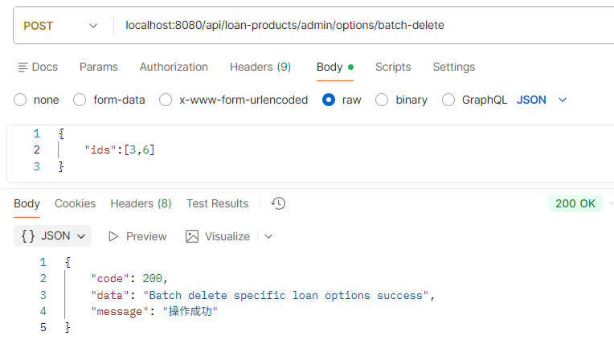

**日志**：

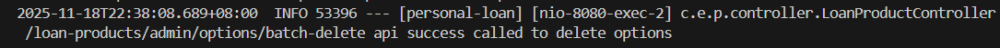

### 批量删除产品

**网址** /api/loan-products/admin/products/batch-delete

**请求方式** POST

**请求参数**:

|字段名|类型|是否必填|说明|示例值|
|---|---|---|---|---|
| ids | Array | 是 | 要删除的贷款产品 ID 列表 | [8, 10] |

**请求示例（请求体）：**

``` json
{
  "ids": [8,10]
}
```

**返回数据** :

``` json
{
    "code": 200,
    "data": "Batch delete loan products success",
    "message": "操作成功"
}
```

**postman测试结果**:

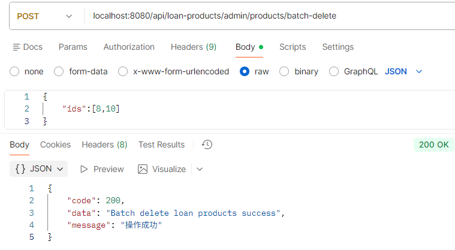

**日志**：

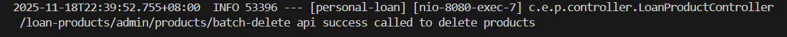

### 修改产品信息

**网址**：/api/loan-products/admin/products/{productId}

**请求方式** PATCH

**请求参数（可选）**:

|字段名|类型|是否必填|说明|示例值|
|---|---|---|---|---|
| productName | string | 否 | 产品名称 |极速贷 Pro（表示将该产品的名称改为极速贷 Pro）|
| description | string | 否 | 产品描述 |  |
| loanUsage | string | 否 | 产品用途 |   |
| minTerm | integer | 否 | 最短借款期限（单位：月）|    |
| maxTerm | integer | 否 | 最长借款期限（单位：月）|   |
| termStep | integer | 否 | 期限递增步长（单位：月）|   |
| promotionDetails | string | 否 | 促销文案 |   |
| options | array | 否 | 可选方案列表 |   |

**options 中的字段说明（除id外可选）**:

|字段名|类型|是否必填|说明|示例值|
|---|---|---|---|---|
| id  | integer | 是 | 该产品需要更改的选项id | 2 |
| loanAmount | number | 否 | 贷款额度（单位：元）,最多12位数字，其中小数部分2位|   |
| loanPeriod |integer | 否 | 贷款期限（单位：月）|   |
| interestRate | number | 否 | 年化利率,最多6位数字，其中小数部分4位 | 0.045  |
| repaidType | string | 否 | 还款方式，"等额本金"、"等额本息"、"一次性还本付息" |  |

**请求示例（网址）** /api/loan-products/admin/products/2

**请求示例（请求体）**:

``` json
{
  "productName": "极速贷 Pro",
  "maxTerm": 36,
  "options": [
    {
      "id": 2,
      "interestRate": 0.045
    }
  ]
}
```

**返回数据**:

``` json
{
    "code": 200,
    "data": {
        "id": 2,
        "productName": "极速贷 Pro",
        "description": "审批快，放款快",
        "loanUsage": "消费、装修、教育",
        "minTerm": 3,
        "maxTerm": 36,
        "termStep": 3,
        "promotionDetails": "无",
        "options": [
            {
                "id": 2,
                "productId": 2,
                "loanPeriod": 12,
                "loanAmount": 10000,
                "interestRate": 0.045,
                "repaidType": "等额本息",
                "createTime": "2025-11-18T17:10:45",
                "updateTime": "2025-11-18T17:57:24"
            },
            {
                "id": 6,
                "productId": 2,
                "loanPeriod": 18,
                "loanAmount": 20000,
                "interestRate": 0.055,
                "repaidType": "等额本金",
                "createTime": "2025-11-18T17:45:05",
                "updateTime": "2025-11-18T17:45:05"
            },
            {
                "id": 7,
                "productId": 2,
                "loanPeriod": 24,
                "loanAmount": 50000,
                "interestRate": 0.06,
                "repaidType": "先息后本",
                "createTime": "2025-11-18T17:45:05",
                "updateTime": "2025-11-18T17:45:05"
            }
        ],
        "createTime": "2025-11-18T17:10:45",
        "updateTime": "2025-11-18T17:57:24.5318755"
    },
    "message": "贷款产品更新成功"
}
```

**postman测试结果**:


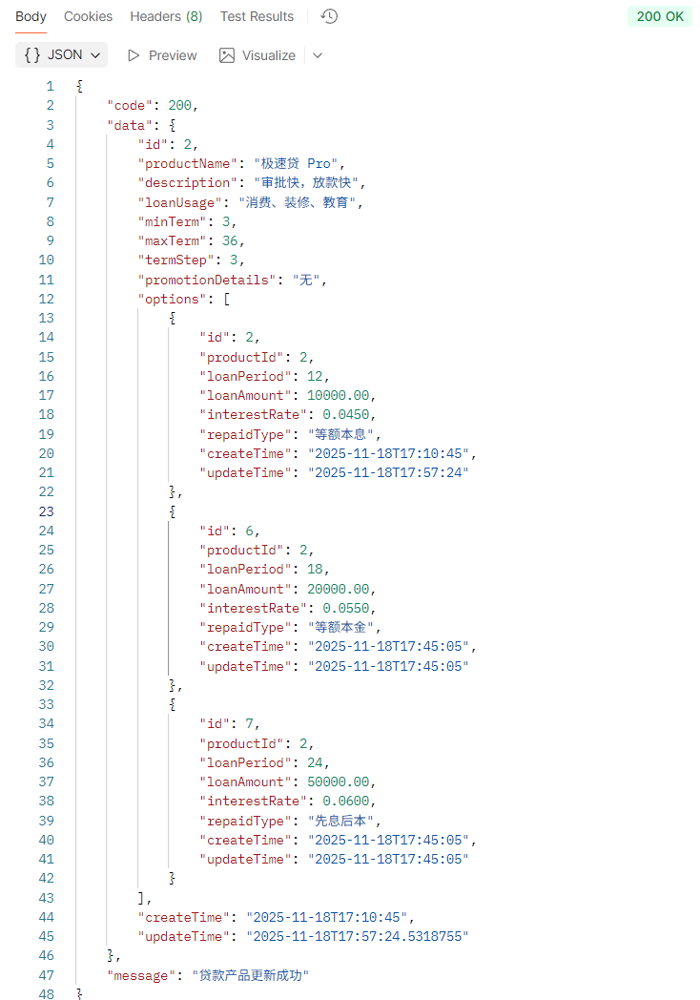

**日志**：

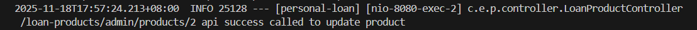

### 获取产品列表

**网址** /api/loan-products/admin

**请求方式** GET

**返回数据**:

``` json
{
    "code": 200,
    "data": [
        {
            "productId": 1,
            "productName": "优享贷",
            "description": "专为信用良好用户定制，利率优惠，期限灵活",
            "usage": "教育、购车、旅游、大额消费",
            "status": "INACTIVE",
            "createTime": "2025-11-21T13:22:05",
            "updateTime": "2025-12-01T13:26:08"
        },
        {
            "productId": 2,
            "productName": "极速贷",
            "description": "专为信用良好用户定制，利率优惠，期限灵活",
            "usage": "教育、购车、旅游、大额消费",
            "status": "INACTIVE",
            "createTime": "2025-11-21T13:23:46",
            "updateTime": "2025-12-01T13:16:32"
        }
    ],
    "message": "操作成功"
}
```

**postman测试结果：**

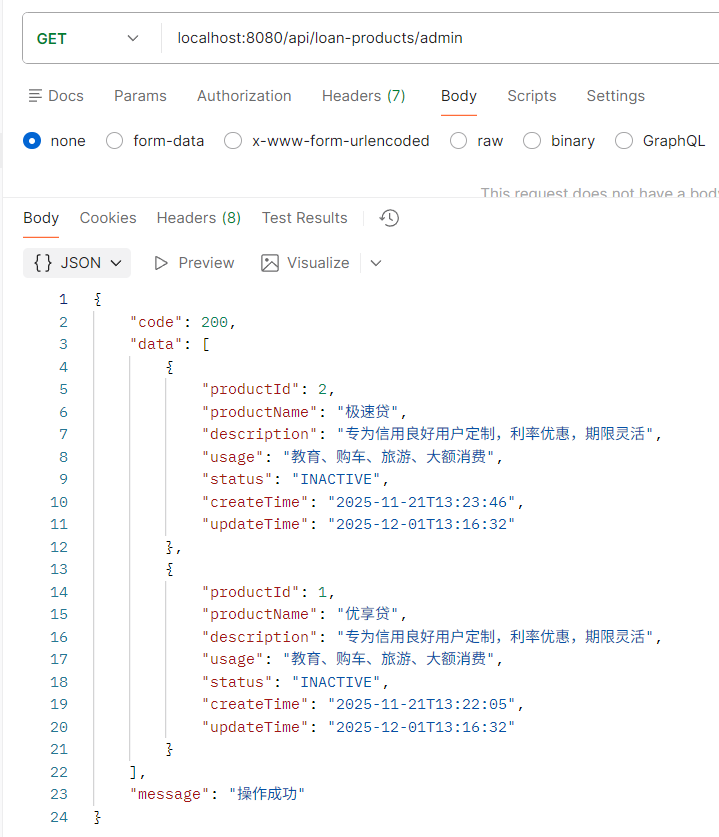

**日志**：

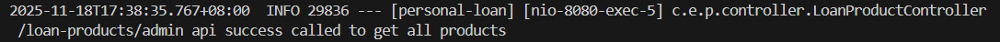

### 获取指定产品详情

**网址** /api/loan-products/admin/{productId}

**请求方式**  GET

**请求参数**:

|字段名|类型|是否必填|说明|示例值|
|---|---|---|---|---|
|productId|integer|是|产品Id|2|

**请求示例（网址）** /api/loan-products/admin/2

**返回数据**:

``` json
{
    "code": 200,
    "data": {
        "id": 2,
        "productName": "极速贷",
        "description": "审批快，放款快",
        "loanUsage": "消费、装修、教育",
        "minTerm": 3,
        "maxTerm": 24,
        "termStep": 3,
        "promotionDetails": "无",
        "options": [
            {
                "id": 2,
                "productId": 2,
                "loanPeriod": 12,
                "loanAmount": 10000.00,
                "interestRate": 0.0490,
                "repaidType": "等额本息",
                "createTime": "2025-11-18T17:10:45",
                "updateTime": "2025-11-18T17:10:45"
            }
        ],
        "createTime": "2025-11-18T17:10:45",
        "updateTime": "2025-11-18T17:10:45"
    },
    "message": "操作成功"
}
```

**postman测试结果：**

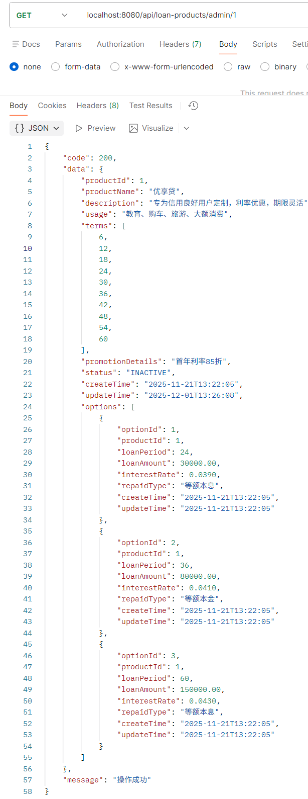

**日志**：

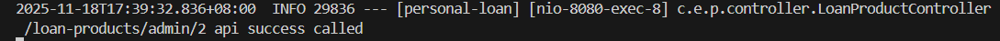