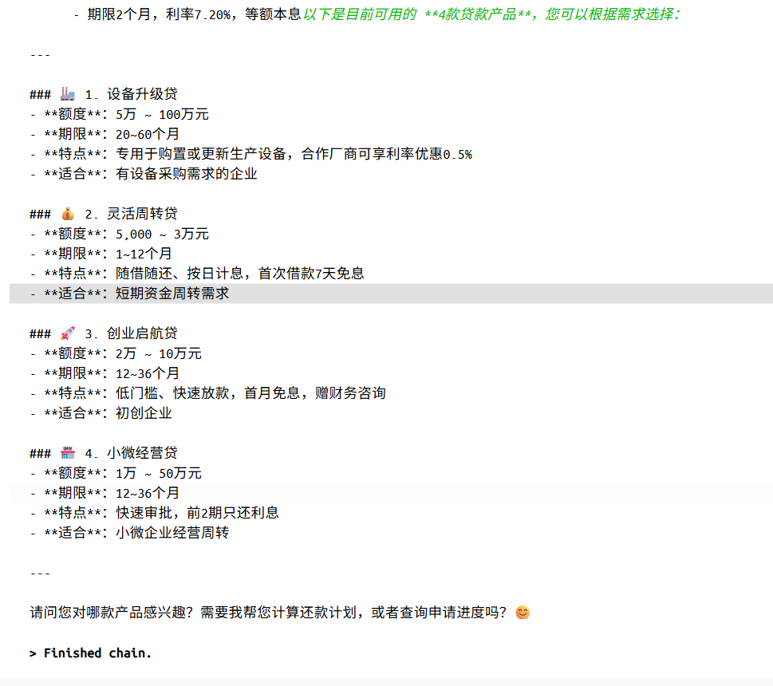

# 接口文档

可以通过 http://localhost:8000/docs 查看接口文档。

## 用户接口

**网址** http://127.0.0.1:8000/api/chat/stream

**请求方式** POST

**对话示例**  

### 1. 初始化会话

    ``` text
    event: session_init
    data: {"session_id": "24c2f2d5-6499-4f1c-8e66-df46e986abf7"}

    event: message
    data: 您好

    event: message
    data: ！

    event: message
    data: 我是

    event: message
    data: 贷款

    event: message
    data: 智能

    event: message
    data: 客服

    event: message
    data: ，

    event: message
    data: 很高兴

    event: message
    data: 为您

    event: message
    data: 服务

    event: message
    data: ！

    event: message
    data: 请问

    event: message
    data: 有什么

    event: message
    data: 可以

    event: message
    data: 帮

    event: message
    data: 您的

    event: message
    data: 吗

    event: message
    data: ？
    ```

### 2. 用户询问还款计划

**请求示例（请求体）**  

    ```json
    {
      "message": "我有一笔贷款，10000元，贷12个月，利率0.065，还款方式是先息后本，帮我计算一下还款计划",
      "session_id": "24c2f2d5-6499-4f1c-8e66-df46e986abf7"
    }
    ```

**返回数据示例（响应体）**  

[calculate_repayment_response.txt](calculate_repayment_response.txt)

### 3. 用户询问贷款状态

**返回数据示例（响应体）**  

[query_app_status_response.txt](query_app_status_response.txt)

### 4. 用户询问最新贷款政策

**请求示例（请求体）**  

    ```json
    {
      "message": "当前最新的贷款政策有哪些",
      "session_id": "24c2f2d5-6499-4f1c-8e66-df46e986abf7"
    }
    ```

### 5. 用户询问贷款产品

**请求示例（请求体）**  

    ```json
    {
      "message": "帮我查询有哪些贷款产品可以使用",
      "session_id": "41948804-c3be-4719-91ae-9711e53b1195"
    }
    ```

**返回数据示例（响应体）**  

[query_products_response.txt](query_products_response.txt)  


## 管理员接口

### 增加知识库

**网址** http://localhost:8000/knowledge/

**请求方式** POST

**请求示例（请求体）**  

    ```json
    {
      "question": "提交申请后什么时候能通过？",
      "answer": "提交贷款申请后，通常需要审核1-2天",
      "category": "通用"
    }
    ```

**返回数据示例（响应体）**  

    ```json
    {
      "code": 200,
      "data": {
        "id": "0b813589-c857-4161-89bc-cfa594cf74ac",
        "question": "提交申请后什么时候能通过？",
        "answer": "提交贷款申请后，通常需要审核1-2天",
        "category": "通用",
        "created_at": "2026-04-27 20:32:49",
        "updated_at": "2026-04-27 20:32:49"
      },
      "message": "添加成功"
    }
    ```

### 查看知识库

**网址** http://localhost:8000/knowledge/

**请求方式** GET

**返回数据**  

    ```json
    {
      "code": 200,
      "data": [
        {
          "id": "0b813589-c857-4161-89bc-cfa594cf74ac",
          "question": "提交申请后什么时候能通过？",
          "answer": "提交贷款申请后，通常需要审核1-2天",
          "category": "通用"
        },
        {
          "id": "b38a665e-8d95-4e3e-93e0-77683cfe0afb",
          "question": "在哪里查看贷款审核是否通过",
          "answer": "点击我的主页，我的贷款，可以查看贷款审核进度",
          "category": "通用"
        }
      ],
      "message": "获取成功"
    }
    ```

### 删除知识库

### 添加MCP服务器配置

**网址** http://localhost:8000/api/tools/mcp/server

**请求方式** POST

**请求示例（请求体）**  

    ```json
    {
      "server_id": "tavily_search",
      "transport": "sse",
      "url": "https://api.tavily.com/mcp-server",
      "api_key": "your_tavily_api_key_here",
      "timeout": 30000
    }
    ```

**返回数据示例（响应体）**  

    ```json
    {
      "code": 200,
      "data": {
        "server_id": "tavily_search",
        "transport": "sse",
        "url": "https://mcp.tavily.com/sse",
        "timeout": 30000,
        "tools_count": 0
      },
      "message": "MCP服务器添加成功"
    }
    ```

### 获取MCP服务器配置

**网址** http://localhost:8000/api/tools/mcp/servers

**请求方式** GET

**返回数据示例（响应体）**  

    ```json
    {
      "code": 200,
      "data": [
        {
          "server_id": "tavily_search",
          "transport": "sse",
          "url": "https://mcp.tavily.com/sse",
          "timeout": 30000,
          "created_at": "2026-05-08T23:06:45.049000",
          "updated_at": "2026-05-08T23:06:45.049000"
        }
      ],
      "message": "获取MCP服务器列表成功"
    }
    ```

### 删除MCP服务器配置

**网址** http://localhost:8000/api/tools/mcp/server/{server_id}

**请求方式** DELETE

**请求示例（网址）** ：/api/tools/mcp/server/tavily_search

**返回数据示例（响应体）**  

    ```json
    {
      "code": 200,
      "data": null,
      "message": "MCP服务器 tavily_search 删除成功"
    }
    ```

### 设置工具状态（静态工具）

**网址** /api/tools/{tool_name}

**请求方式** PUT

**请求示例（网址）** ：/api/tools/search_web?enabled=false

**请求参数说明**：

- tool_name：工具名称，例如 search_web
- enabled：是否启用工具，true 表示启用，false 表示禁用

**返回数据示例（响应体）**  

    ```json
    {
      "code": 200,
      "data": null,
      "message": "工具 search_web 禁用 成功"
    }
    ```

### 获取所有工具

**网址** /api/tools

**请求方式** GET

**返回数据示例（响应体）**  

    ```json
    {
      "code": 200,
      "data": [
        {
          "name": "query_application_status",
          "description": "帮助用户查询贷款申请状态。当用户主动要求帮忙查询申请进度、申请状态时使用。",
          "enabled": true,
          "source": "static"
        },
        {
          "name": "calculate_repayment",
          "description": "计算还款计划。当用户询问月还款额、还款金额、还款计划时使用。\n\n    参数说明：\n    - repaid_type: 还款方式，支持\"等额本息\"、\"等额本金\"、\"先息后本\"、\"一次性还本付息\"\n    - loan_amount: 贷款金额，单位元\n    - loan_period: 贷款期限，单位月\n    - interest_rate: 年利率，如0.12表示12%",
          "enabled": true,
          "source": "static"
        },
        {
          "name": "query_loan_products",
          "description": "获取所有贷款产品列表。当用户询问有哪些贷款产品、贷款产品详情、可申请的贷款产品时使用。",
          "enabled": true,
          "source": "static"
        },
        {
          "name": "search_web",
          "description": "使用 Tavily 搜索引擎搜索网络信息。当需要获取最新的外部信息时使用。",
          "enabled": false,
          "source": "static"
        },
        {
          "name": "search_knowledge",
          "description": "在知识库中搜索相关信息。当用户询问常见问题、政策规则、产品信息时使用。",
          "enabled": true,
          "source": "static"
        }
      ],
      "message": "获取工具列表成功"
    }
    ```
