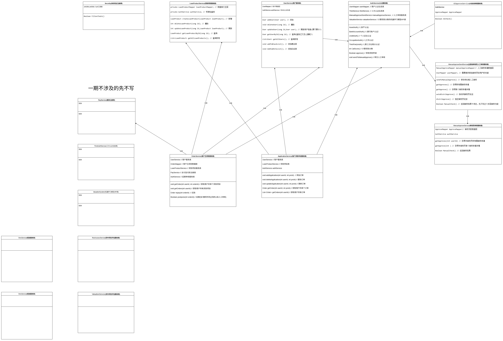
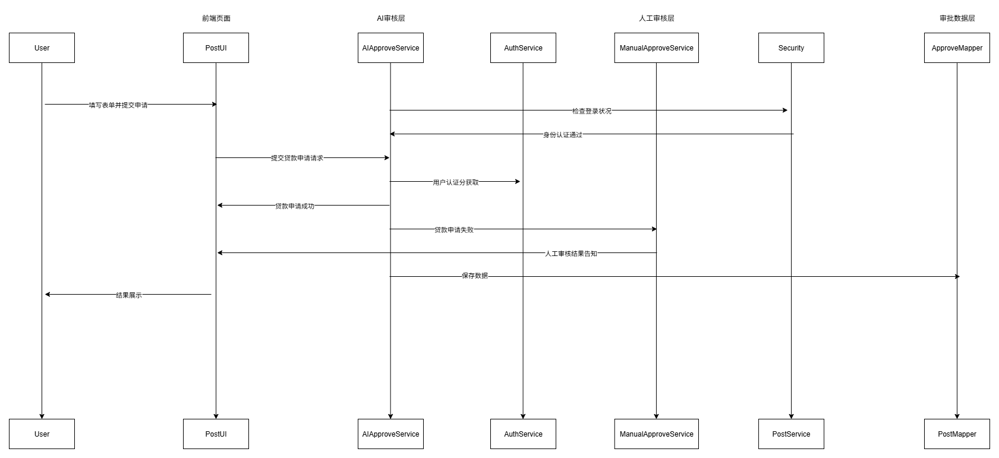

好的！以下是根据你提供的《软件体系结构设计报告模板.docx》格式，为“**多数据风控系统的贷款项目**”撰写的一份完整的**软件体系结构设计报告**。你可以将以下内容复制到 Word 文档中，并替换原模板的封面页等信息。

---

# 软件体系结构设计报告  
**项目名称：多数据风控系统（贷款业务）**  


|序号| 姓名|学号| 职责|分工(本学期)|
|-|-|-|-|-|
|1|龚陈陈|2024091203018|组长|文档撰写/后端|
|2|王婷|2024091201030|组员|web端|
|3|覃雨欣|2024091201029|组员|安卓端|
|4|周飞凤|2024091201028|组员|后端

---

## 目录

1. [引言](#1-引言)  
2. [系统总体设计](#2-系统总体设计)  
3. [软件结构划分](#3-软件结构划分)  
4. [面向对象设计（逻辑视图）](#4-面向对象设计逻辑视图)  
5. [数据持久化设计](#5-数据持久化设计)  
6. [部署设计](#6-部署设计)  
7. [设计模式与复用机制](#7-设计模式与复用机制)  
8. [系统质量属性设计](#8-系统质量属性设计)  
9. [结论与展望](#9-结论与展望)  

---

## 1. 引言

### 1.1 编写目的  
本报告旨在描述《多数据源融合的互联网个人贷款及全流程风控系统》的软件体系结构设计，明确系统的模块划分、层次结构、关键类与交互流程，并通过 UML 图形化建模展现系统逻辑与物理结构。预期读者包括项目开发人员、测试人员、项目经理及评审教师。

### 1.2 项目概述  
本系统面向互联网金融场景，支持用户在线申请小额贷款。系统通过整合多源数据（如征信、运营商、社保、行为日志等），利用规则引擎与机器学习模型进行风险评估，实现自动化审批与额度定价。目标用户为金融机构风控部门与终端借款人。

核心功能包括：  
- 用户身份认证与资料提交  
- 多源数据采集与清洗  
- 风控规则引擎执行  
- 信用评分与决策输出  
- 用户申请贷款及进度查询
- 管理员AI+人工双审批，结果通知与记录  
- 用户已贷款项目管理
- 贷后延期及催债
- 大数据分析与风险预警

### 1.3 参考资料  
- 《需求规格说明书 v1.2》  
- UML 2.5 规范  
- 《设计模式：可复用面向对象软件的基础》  
- Spring Boot 官方文档  
- 《企业应用架构模式》（Martin Fowler）

---

## 2. 系统总体设计

### 2.1 系统架构风格  
本系统采用 **分层架构** 的设计风格：  
- 整体上划分为 **表现层、服务层、数据层** 三层，保证关注点分离；  
- 在服务层内部，将风控核心功能拆分为独立的服务（如数据采集服务、规则引擎服务、决策服务、安全认证模块，贷后延期及催债模块），便于独立部署、扩展与维护。  

选型理由：  
- 分层架构提升可维护性与测试性；  
- 服务层解耦化在高并发场景下性能更优  
- 便于未来引入第三方风控模型或对接外部数据平台。

### 2.2 系统模块划分  

| 模块名称 | 职责说明 | 主要接口 | 依赖关系 |
|----------|--------|--------|--------|
| 用户接入模块 | 处理用户注册、登录、贷款申请表单提交 | `UserService`，`OrderService`, `ApplicationService` | 调用风控决策模块 |
| 管理员管理模块 | 处理贷款项目，用户，人工审核分发 | `LoanProductService`，`ManualApproveSendService` | 调用风控决策模块 |
| 数据采集模块 | 对接征信、运营商、社保等外部数据源 | `ThirdAuthService`，`AuthService` | 依赖外部 API，被风控模块调用 |
| 风控规则引擎模块 | 执行预设风控规则（如黑名单、负债率阈值） | `RiskAssessService` | 依赖数据采集模块 |
| 信用评分模块 | 基于机器学习模型计算用户信用分 | `ValuationService` | 依赖数据采集模块 |
| 决策中心模块 | 综合规则与评分结果，输出审批结论 | `ManualApproveService`，`AIApproveService` | 调用规则引擎与评分模块 |
| 通知与日志模块 | 发送短信/邮件通知，记录审批日志 | `SmsService`, `emailService` | 被决策模块调用 |
| 安全模块 | 用户jwt无状态通过 | `JwtInterceptor` | 网络请求时自动拦截调用 |

> 注：各模块间通过 RESTful API 或消息队列（如 RabbitMQ）进行通信。

---

## 3. 软件结构划分

### 3.1 系统分层结构  
  
| 层次名称 | 职责说明 | 主要类/模块 | 向上提供的接口 | 依赖的下层 |
|--------|--------|-----------|--------------|----------|
| 表现层（UI/API Gateway） | 接收用户请求，返回审批结果 | `OrderController`,<br>`AuthController`,<br>`LoanProductService`,<br>`UserController`,<br> | — | 服务层 |
| 服务层（Service） | 实现风控核心逻辑 | `ValuationService`,<br> `RiskAssessService`,<br>`ValuationSystem`，`PayService`,<br>`ThirdAuthService`,<br> | `ApplicationService`,<br>`AuthService`,<br>`LoanProductService`,<br>`ManualApproveSendService`,<br>`ManualApproveService`,<br>`AIApproveService`,<br>`PayService`,<br>`smsService`,<br>`EmailService`,<br>`UserService` | 数据访问层 |
| 数据访问层（DAO） | 访问本地数据库与外部数据源 | `BlackListMapper`,<br>`LoanApplicationMapper`,<br>`LoanOptionMapper`,<br>`LoanProductMapper`,<br> `OrderMapper`,<br>`UserMapper`,<br> |  `BlackListMapper`,<br>,`LoanApplicationMapper`,<br>,`LoanOptionMapper`,<br>`LoanProductMapper`,<br> `OrderMapper`,<br>`UserMapper`,<br> | 数据库/第三方API |

### 3.2 模块划分与构件图  
（此处应插入 UML 构件图，图略，文字描述如下）  
- 系统由 8 个主要构件组成，部署为一整个 Spring Boot 应用；  
- 构件间通过 HTTP/JSON 或 AMQP 协议通信；  
- 决策中心为协调者，聚合多个风控子服务结果。

### 3.3 包结构设计（Package Diagram）  
包结构如下（建议绘制包图）：

```
com.personalloan  
├── controller        // 表现层：Controller, DTO
|   └── dto           // 数据传输对象层
├── entity            // java数据类
├── service           // 业务逻辑：ApplicationService, AIApproveService, ManualApproveService, PayService
|   └── impl          // 服务实现层
├── mapper        // 数据访问对象层
├── config        // 配置层
├── security      // 安全层          
├── exception     // 异常处理层
├── utils         // 工具类层
├── handler       // 拦截器
└── enums         // 枚举类型层
```

---

## 4. 面向对象设计（逻辑视图）

### 4.1 类图（Class Diagram）  



部分类图因无法明确实现方式或者综设1阶段不涉及，不给出具体实现方式

### 4.2 时序图（Sequence Diagram）  

**典型用例：用户提交贷款申请 → 系统自动审批**



其余时序图因综设1不涉及，此处不提供
---

## 5. 数据持久化设计

### 5.1 数据模型与 ER 图  
主要实体：  
- `user`（用户基本信息）  
- `LoanApplications`贷款申请记录
- `LoanProduct`贷款项目
- `LoanOption`贷款项目详细选项
- `BlackList` 用户黑名单
- `Order` 用户已贷款订单记录  
- `UserCertification` 用户认证总表
- `TriCert` 用户三方认证
- `ImmovablesCert` 用户不动产认证
- `WorkCert` 用户工作认证

### 5.2 数据访问机制  
- 采用 **MyBatis-Plus** 混合方案；  
- 本地数据库使用 **MySQL 8.0**，支持事务；  
- 敏感字段（如身份证号）加密存储（AES-256）。

---

## 6. 部署设计

系统部署于阿里云服务器：
本项目和Mysql、redis采用docker-compose集成部署于同一台服务器

- **前端**：android/iOS 客户端, html5 网页端。
- **应用服务层**: 与数据库部署于同一台服务器上
- **数据层**：  
  - MySQL 主从集群（读写分离）  
  - Redis 缓存集群  
  - RabbitMQ 消息队列（异步通知）  
- **安全**：HTTPS + JWT 认证，WAF 防护

---

## 7. 设计模式与复用机制

- **策略模式**：不同风控策略（规则 vs 模型）可插拔切换；  
- **工厂模式**：`AuthFactory` 动态创建不同外部数据源认证服务；  
- **观察者模式**：审批结果触发通知、日志、统计等多个监听器；  
- **单例模式**：全局配置管理器 `ConfigManager`；  
- **门面模式**：`RiskAssessmentService` 封装复杂风控流程，对外提供统一接口。

---

## 8. 系统质量属性设计

| 质量属性 | 设计措施 |
|--------|--------|
| **可扩展性** | 微服务架构，支持横向扩容；规则与模型解耦，便于新增风控维度 |
| **可维护性** | 分层清晰，模块职责单一；日志与监控全覆盖（Prometheus + Grafana） |
| **安全性** | 数据传输加密、敏感信息脱敏、RBAC 权限控制、防刷机制 |
| **性能** | 异步数据采集、Redis 缓存、批量处理、熔断降级（Sentinel） |
| **可用性** | 多副本部署、健康检查、自动重启、灾备方案 |

---

## 9. 结论与展望

本报告完成了多数据风控系统的体系结构设计，采用分层架构，具备良好的扩展性与稳定性。当前设计已覆盖核心风控流程，但仍有改进空间：  
- 未来可引入实时流处理（如 Flink）支持动态行为风控；  
- 增加 A/B 测试框架以评估不同模型效果；  
- 探索联邦学习，在保护隐私前提下联合多方数据建模。

---